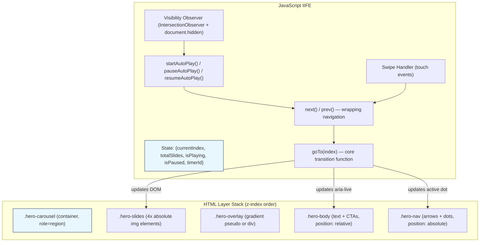
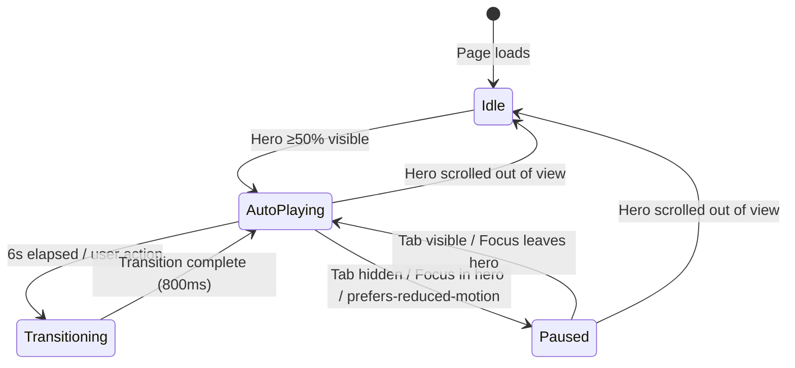

# Design Document: Hero Section Carousel

## Overview

The Hero Section Carousel replaces the existing gradient + typewriter hero with a full-viewport image carousel showcasing premium architectural interiors. The component is built entirely with vanilla HTML, CSS, and JavaScript following the project's existing patterns.

**Key architectural decisions:**
- **Layered composition**: Slides (absolute-positioned images), overlay gradient, and fixed text content live in separate stacking layers so transitions affect only the image layer.
- **State-driven rendering**: A single JS state object (`currentIndex`, `isPlaying`, `isPaused`) drives all DOM updates (active classes, aria attributes, live region text).
- **CSS-only transitions**: Slide changes use `opacity` transitions on pre-rendered `` elements (no DOM insertion/removal during transitions).
- **IIFE encapsulation**: All carousel logic lives in a single IIFE in `js/hero.js`, exposing nothing to `window`.

---

## Architecture



### Data Flow

1. **Initialization**: IntersectionObserver detects hero is ≥50% visible → calls `startAutoPlay()`.
2. **Auto-play tick**: `setInterval` fires every 6s → calls `next()` → calls `goTo((current+1) % total)`.
3. **User interaction** (click arrow, click dot, swipe, keyboard): Calls `goTo(targetIndex)` + `resetTimer()`.
4. **goTo(index)**: Updates `currentIndex`, toggles `.is-active` on slides/dots, updates `aria-current`, updates aria-live region text.
5. **Visibility change**: `document.hidden` → `pauseAutoPlay()`. Visible again → `resumeAutoPlay()`.
6. **Focus enters hero**: `focusin` on hero container → `pauseAutoPlay()`. `focusout` → `resumeAutoPlay()`.

---

## Components and Interfaces

### HTML Structure

```html
<section class="hero-carousel" role="region" aria-label="Carrossel de destaques" data-hero-carousel>
  <!-- Background Slides -->
  <div class="hero-slides" aria-hidden="true">
    
    
    
    
  </div>

  <!-- Gradient Overlay -->
  <div class="hero-overlay" aria-hidden="true"></div>

  <!-- Text Content (fixed during transitions) -->
  <div class="hero-body">
    <div class="hero-content">
      <h1 class="hero-heading">Instalação, Vendas e Projetos de Alto Padrão em São Paulo</h1>
      <p class="hero-subtitle">Instalação, manutenção e suporte técnico em climatização e refrigeração para residências e empresas, com transparência e excelência do início ao fim.</p>
      <div class="hero-actions">
        <a href="contact.html" class="btn hero-btn-primary">Solicite um Orçamento</a>
        <a href="#projetos" class="btn hero-btn-secondary">Conheça nossos serviços</a>
      </div>
    </div>

    <!-- Navigation Controls -->
    <div class="hero-controls">
      <!-- Arrows (hidden on mobile via CSS) -->
      <button class="hero-arrow hero-arrow-prev" aria-label="Slide anterior" type="button">
        <svg><!-- chevron left --></svg>
      </button>
      <button class="hero-arrow hero-arrow-next" aria-label="Próximo slide" type="button">
        <svg><!-- chevron right --></svg>
      </button>

      <!-- Indicator Dots -->
      <div class="hero-dots" role="tablist" aria-label="Navegação de slides">
        <button class="hero-dot is-active" role="tab" aria-label="Ir para slide 1" aria-current="true" type="button"></button>
        <button class="hero-dot" role="tab" aria-label="Ir para slide 2" type="button"></button>
        <button class="hero-dot" role="tab" aria-label="Ir para slide 3" type="button"></button>
        <button class="hero-dot" role="tab" aria-label="Ir para slide 4" type="button"></button>
      </div>
    </div>
  </div>

  <!-- Aria Live Region (visually hidden) -->
  <div class="sr-only" aria-live="polite" aria-atomic="true" data-hero-live></div>
</section>
```

### JavaScript Module Interface (Internal IIFE)

```javascript
// js/hero.js — IIFE, no exports to window
(function HeroCarousel() {
  // --- State ---
  const state = {
    currentIndex: 0,
    totalSlides: 4,
    isPlaying: false,
    isPaused: false,
    timerId: null,
    transitionDuration: 800 // ms (between 600-1000)
  };

  // --- Core API (internal) ---
  function goTo(index)        // Transition to slide at index
  function next()             // goTo((current + 1) % total)
  function prev()             // goTo((current - 1 + total) % total)
  function startAutoPlay()    // Begin 6s interval
  function pauseAutoPlay()    // Clear interval, set isPaused
  function resumeAutoPlay()   // Restart interval if not isPaused
  function resetTimer()       // Clear + restart interval

  // --- Event Handlers ---
  function onArrowClick(direction)
  function onDotClick(index)
  function onSwipeStart(e)
  function onSwipeMove(e)
  function onSwipeEnd(e)
  function onKeydown(e)
  function onVisibilityChange()
  function onFocusIn()
  function onFocusOut()
  function onIntersection(entries)
  function onImageError(e)

  // --- DOM Update ---
  function updateSlides()     // Toggle .is-active on slides
  function updateDots()       // Toggle .is-active + aria-current on dots
  function updateLiveRegion() // Set textContent on aria-live element

  // --- Init ---
  function init()             // Called on DOMContentLoaded
})();
```

### CSS Class Responsibilities

| Class | Purpose |
|-------|---------|
| `.hero-carousel` | Container: position relative, min-height 100vh/100dvh, overflow hidden |
| `.hero-slides` | Absolute fill container for slide images |
| `.hero-slide` | Absolute fill, object-fit cover, opacity 0, transition opacity |
| `.hero-slide.is-active` | opacity 1 |
| `.hero-overlay` | Absolute fill, gradient from --c-deep/--c-sky |
| `.hero-body` | Relative positioned, flex column, z-index above overlay |
| `.hero-content` | Max-width container for text, left-aligned |
| `.hero-heading` | Barlow 700, clamp(32px, 5vw, 48px), white |
| `.hero-subtitle` | Inter 400, clamp(16px, 2vw, 20px), white/90% |
| `.hero-actions` | Flex wrap row (stacked on mobile) |
| `.hero-btn-primary` | --c-sky background, --c-white text |
| `.hero-btn-secondary` | Ghost with white/30% border |
| `.hero-arrow` | Absolute positioned, vertically centered, hidden < 768px |
| `.hero-dots` | Absolute bottom-left, flex row |
| `.hero-dot` | 12px circle (44x44 touch target via padding), opacity transition |
| `.hero-dot.is-active` | Extended width (pill shape) + full opacity |

---

## Data Models

### Carousel State Object

```typescript
interface CarouselState {
  currentIndex: number;    // 0-based index of active slide
  totalSlides: number;     // Always 4 for this implementation
  isPlaying: boolean;      // Whether auto-play interval is active
  isPaused: boolean;       // Whether paused by visibility/focus
  timerId: number | null;  // setInterval ID for auto-play
  transitionDuration: number; // CSS transition ms (800)
}
```

### Slide Transition State Machine



### Swipe Gesture Data

```typescript
interface SwipeData {
  startX: number;       // touchstart clientX
  startY: number;       // touchstart clientY
  currentX: number;     // latest touchmove clientX
  currentY: number;     // latest touchmove clientY
  isTracking: boolean;  // whether we're in a valid swipe
}

// Swipe triggers when:
// abs(deltaX) > 50 AND abs(deltaX) > abs(deltaY)
```

---

## Correctness Properties

*A property is a characteristic or behavior that should hold true across all valid executions of a system — essentially, a formal statement about what the system should do. Properties serve as the bridge between human-readable specifications and machine-verifiable correctness guarantees.*

### Property 1: Slide navigation is circular

*For any* carousel with N slides and any current index i in [0, N-1], advancing (next) should produce index (i + 1) % N, and retreating (prev) should produce index (i - 1 + N) % N, regardless of the input method (arrow click, dot click, swipe, or keyboard).

**Validates: Requirements 1.4, 2.3, 2.4, 4.2, 4.3, 4.6, 4.7**

### Property 2: Auto-play timer resets on any user interaction

*For any* user interaction event (arrow click, dot click, swipe completion, or keyboard navigation) occurring while auto-play is active, the auto-play timer SHALL be reset to a full 6-second interval from the moment of interaction, and the previously scheduled tick SHALL be cancelled.

**Validates: Requirements 1.2**

### Property 3: Active slide indicator synchronization

*For any* slide change to index i out of N total slides, the indicator dot at position i SHALL have the `.is-active` class and `aria-current="true"`, while all other dots SHALL have neither the `.is-active` class nor `aria-current="true"`.

**Validates: Requirements 3.3, 12.3**

### Property 4: Indicator dot count equals slide count

*For any* rendered carousel state, the number of indicator dot elements SHALL equal the number of slide image elements.

**Validates: Requirements 3.1**

### Property 5: Direct dot navigation targets correct slide

*For any* dot index i in [0, N-1] that is clicked or activated via keyboard, the carousel SHALL transition to slide index i, making that slide the active one.

**Validates: Requirements 3.4**

### Property 6: Swipe threshold enforcement

*For any* touch gesture where the absolute horizontal displacement is ≤ 50px, the current slide index SHALL remain unchanged after the gesture completes.

**Validates: Requirements 4.5**

### Property 7: Scroll prevention during horizontal swipe

*For any* touchmove event where `abs(deltaX) > abs(deltaY)` (horizontal swipe detected), the event's default behavior (vertical scrolling) SHALL be prevented.

**Validates: Requirements 4.8**

### Property 8: Aria-live region announcement on slide change

*For any* slide change to index i out of N total slides, the aria-live region text content SHALL be updated to "Slide {i+1} de {N}".

**Validates: Requirements 12.1**

### Property 9: Text content position invariant during transitions

*For any* slide transition from index i to index j, the hero text container's computed position (offsetTop, offsetLeft) and opacity SHALL remain constant throughout the transition.

**Validates: Requirements 5.3**

---

## Error Handling

| Error Condition | Handling Strategy |
|----------------|-------------------|
| First image fails to load (timeout 5s) | `onerror` handler + setTimeout fallback: hide slide container, show `.hero-overlay` as solid gradient background. Text remains legible. |
| Subsequent images fail to load | Skip failed slide in navigation sequence (reduce effective `totalSlides`). Log warning to console. |
| JavaScript fails to load/execute | Hero displays first image (eager-loaded) + overlay + text as static content. No carousel behavior, but content is accessible. |
| IntersectionObserver not supported | Fallback: start auto-play immediately on DOMContentLoaded. |
| Touch events not available | Swipe handler gracefully does nothing (feature-detected via `'ontouchstart' in window`). |
| `prefers-reduced-motion: reduce` | Disable all auto-play. Transitions use instant opacity swap (no animation duration). |

### Fallback Rendering (No JS)

The HTML structure ensures the first slide (with `loading="eager"` and `.is-active` class in markup) + the overlay gradient + text content renders correctly without any JavaScript. This provides a meaningful above-the-fold experience even if JS fails.

---

## Testing Strategy

### Unit Tests (Example-Based)

These cover specific configuration, DOM structure, and accessibility requirements:

- Hero container has `role="region"` and correct `aria-label`
- Arrow buttons have correct `aria-label` values
- First image has `loading="eager"`, rest have `loading="lazy"`
- Arrows hidden on viewport < 768px
- CTA buttons have correct text content and href values
- Overlay gradient does not contain pure black (`#000000` or `rgb(0,0,0)`)
- Hero min-height is 100vh on desktop, 100dvh on mobile
- Header becomes transparent when hero is at top (integration test)
- `prefers-reduced-motion: reduce` disables auto-play
- Image load failure triggers fallback gradient display

### Property-Based Tests

Each correctness property above will be implemented as a property-based test using **fast-check** (JavaScript PBT library).

**Configuration:**
- Minimum 100 iterations per property
- Each test tagged with: `Feature: hero-section-carousel, Property {N}: {title}`
- Tests operate on the carousel state management functions (pure logic extracted from the IIFE for testability)

**Test architecture:** The IIFE will internally define pure functions (`computeNextIndex`, `computePrevIndex`, `shouldTriggerSwipe`, `formatAnnouncement`) that can be exported in a test-only build or tested via a separate module that mirrors the logic. For DOM-dependent properties (3, 4, 9), tests will use jsdom or similar.

### Integration Tests

- Full carousel lifecycle: init → auto-play → user interaction → pause → resume
- Keyboard navigation flow: Tab to arrows → Enter activates → slide changes
- Swipe gesture simulation on mobile viewport
- Header color transition from transparent to solid on scroll

---

## Performance Optimization Strategy

### Critical Rendering Path

1. **First image eager-loaded** (`loading="eager"`) — renders without JS
2. **CSS in `<head>`** — overlay gradient renders immediately via CSS
3. **JS deferred** (`<script src="js/hero.js" defer>`) — carousel behavior initializes after DOM ready
4. **Remaining images lazy** — loaded by browser when needed (or immediately by JS after init)

### GPU Acceleration

```css
.hero-slide {
  will-change: opacity;
  transform: translateZ(0); /* Force GPU layer */
  transition: opacity 800ms cubic-bezier(0.4, 0, 0.2, 1);
}
```

Only `opacity` is animated — no layout or paint triggers during transitions.

### Image Optimization

- First image: ≤ 300KB (use sharp script or manual optimization)
- All images: 1920×1080 minimum, WebP format preferred with PNG fallback
- `object-fit: cover` + `object-position: center` — no layout shifts

### Memory Efficiency

- All 4 images are `` elements in the DOM (no dynamic creation/destruction)
- Only `opacity` toggles — no innerHTML manipulation during transitions
- Single `setInterval` for auto-play (cleared properly on pause/destroy)
- IntersectionObserver with `threshold: 0.5` — one observer, unobserved when hero scrolls out

---

## Integration Plan

### Phase 1: Standalone Development (`hero.html`)

1. Create `hero.html` with full HTML structure, referencing `css/styles.css` and `js/hero.js`
2. Add hero carousel CSS block to `css/styles.css` (single contiguous section with comment header)
3. Create `js/hero.js` with IIFE-encapsulated carousel logic
4. Test in isolation at all breakpoints

### Phase 2: Integration into `index.html`

1. Replace the existing hero `<section>` (the gradient + typewriter section) with the new carousel markup
2. Remove typewriter-related JS from `main.js` (`setupTypewriter` function)
3. Add `<script src="js/hero.js" defer></script>` to `index.html`
4. Modify header styles: add `.is-hero-visible` state that switches header to transparent mode when scroll is 0
5. Verify no CSS conflicts between new `.hero-carousel` classes and existing `.hero` classes (rename existing if needed)

### Header Integration Changes

The existing header uses a white/semi-transparent background. When the hero carousel is present:
- At scroll 0: header background becomes fully transparent, text becomes white
- At scroll > 50px: header transitions back to white background (existing `is-scrolled` behavior in `main.js` `setupStickyHeader`)

This requires:
- A new CSS class `.header-transparent` applied when scroll is 0 and hero is present
- Modification to `setupStickyHeader()` in `main.js` to toggle this class
- CSS rules for `.header-transparent` that set background to transparent and text/logo to white

### File Changes Summary

| File | Action |
|------|--------|
| `hero.html` | **Create** — standalone development file |
| `css/styles.css` | **Append** — hero carousel CSS block |
| `js/hero.js` | **Create** — carousel IIFE |
| `index.html` | **Modify** — replace hero section markup, add script tag |
| `js/main.js` | **Modify** — update `setupStickyHeader` for transparent header state, remove `setupTypewriter` |
