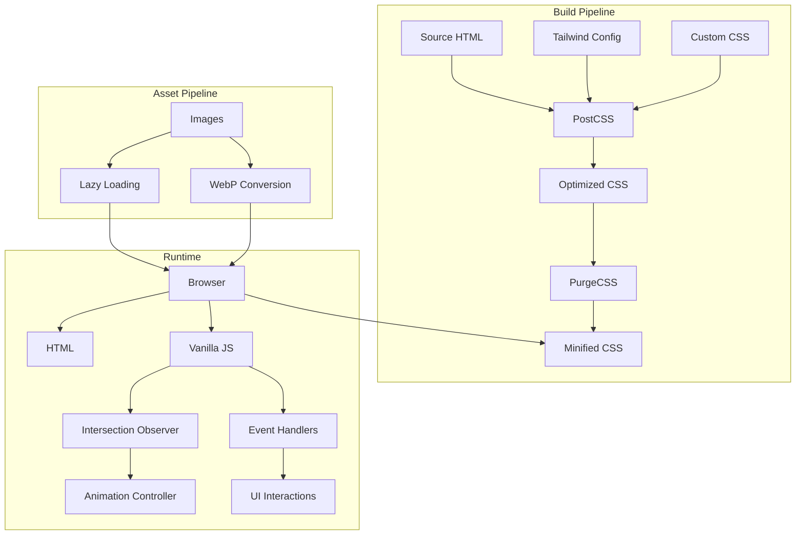
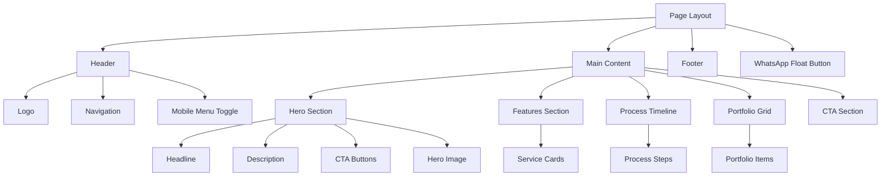

# Technical Design Document: Landing Page Tailwind CSS Rebuild

## Overview

This document specifies the technical design for rebuilding the Grupo ImperAR landing page using Tailwind CSS. The rebuild transforms the existing vanilla CSS implementation into a modern, utility-first CSS architecture while maintaining the HTML structure and vanilla JavaScript foundation.

### Design Goals

1. **Maintainability**: Replace custom CSS with Tailwind utilities for consistent, predictable styling
2. **Performance**: Achieve Lighthouse score ≥90 through optimized CSS delivery and image handling
3. **Developer Experience**: Enable rapid iteration through utility classes and JIT compilation
4. **Visual Polish**: Implement smooth animations, microinteractions, and responsive behavior
5. **Accessibility**: Maintain WCAG AA compliance with keyboard navigation and screen reader support

### Key Design Decisions

**Tailwind Integration Strategy**: Use npm-based installation with PostCSS for build-time optimization rather than CDN to enable PurgeCSS and custom configuration.

**Animation Approach**: Combine Tailwind's transition utilities with custom CSS animations for complex sequences, leveraging Intersection Observer API for scroll-triggered effects.

**Component Architecture**: Organize styles using Tailwind's @layer directive to separate base styles, components, and utilities while maintaining specificity control.

**Responsive Strategy**: Mobile-first approach using Tailwind's responsive prefixes (sm:, md:, lg:, xl:) aligned with custom breakpoints (768px, 1024px).

### Scope

**In Scope**:
- Tailwind CSS configuration and integration
- Migration of all CSS styles to Tailwind utilities
- Responsive design implementation across all breakpoints
- Animation system using Intersection Observer
- Accessibility features (skip links, ARIA attributes, focus states)
- Performance optimization (lazy loading, PurgeCSS, image optimization)
- Cross-browser compatibility

**Out of Scope**:
- Backend functionality or API integration
- Content management system
- Multi-language support beyond Portuguese
- Advanced analytics or tracking
- Email form submission logic (handled by existing EmailJS integration)

## Architecture

### System Architecture



### Technology Stack

**Core Technologies**:
- **HTML5**: Semantic markup with ARIA attributes
- **Tailwind CSS 3.x**: Utility-first CSS framework with JIT mode
- **Vanilla JavaScript (ES6+)**: No framework dependencies
- **PostCSS**: CSS processing with Tailwind and Autoprefixer plugins

**Build Tools**:
- **npm**: Package management
- **PostCSS CLI**: CSS compilation
- **PurgeCSS**: Unused CSS removal (integrated with Tailwind)
- **Autoprefixer**: Vendor prefix automation

**Browser APIs**:
- **Intersection Observer API**: Scroll-triggered animations
- **Web Storage API**: Potential future use for preferences
- **History API**: Smooth scroll behavior

### Directory Structure

```
grupoimperar/
├── css/
│   ├── input.css          # Tailwind directives and custom CSS
│   └── output.css         # Generated CSS (gitignored)
├── js/
│   ├── main.js            # Core functionality
│   ├── animations.js      # Scroll animation controller
│   └── contact.js         # Form validation (contact page)
├── images/                # Optimized images (WebP + JPEG fallbacks)
├── logos/                 # SVG logos
├── index.html             # Landing page
├── services.html          # Services page
├── about.html             # About page
├── contact.html           # Contact page
├── tailwind.config.js     # Tailwind configuration
├── postcss.config.js      # PostCSS configuration
└── package.json           # Dependencies and scripts
```

## Components and Interfaces

### Component Hierarchy



### Core Components

#### 1. Header Component

**Purpose**: Sticky navigation bar with glassmorphism effect on scroll

**Tailwind Classes**:
```html
<header class="fixed top-0 left-0 right-0 z-50 bg-white/90 backdrop-blur-md border-b border-deep/8 transition-shadow duration-200">
  <div class="container mx-auto px-4 py-3.5 flex items-center justify-between gap-4">
    <!-- Logo and Navigation -->
  </div>
</header>
```

**Key Features**:
- Fixed positioning with z-index 50
- Glassmorphism: `bg-white/90 backdrop-blur-md`
- Responsive padding: `py-3.5` (14px) mobile, `lg:py-5` (20px) desktop
- Shadow on scroll: Applied via JavaScript class toggle

**State Management**:
- `.is-scrolled` class added when `window.scrollY > 50`
- Triggers shadow: `shadow-sm` (0 6px 22px rgba(26, 43, 92, 0.12))

#### 2. Hero Section Component

**Purpose**: Full-viewport hero with gradient background and animated content

**Tailwind Classes**:
```html
<section class="min-h-screen flex items-center bg-gradient-to-br from-primary via-primary-dark to-deep text-white">
  <div class="container mx-auto px-4 py-24 grid lg:grid-cols-2 gap-16 items-center">
    <!-- Content and Visual -->
  </div>
</section>
```

**Animation Sequence**:
1. Headline: `opacity-0 translate-y-6` → `opacity-100 translate-y-0` (600ms, 0ms delay)
2. Description: `opacity-0 translate-y-6` → `opacity-100 translate-y-0` (600ms, 100ms delay)
3. CTAs: `opacity-0 translate-y-6` → `opacity-100 translate-y-0` (600ms, 200ms delay)
4. Hero Image: `opacity-0` → `opacity-100` (800ms, 300ms delay)

**Responsive Behavior**:
- Desktop: 2-column grid (`lg:grid-cols-2`)
- Mobile: Single column stack
- Min height: `min-h-screen` desktop, `min-h-[600px]` mobile

#### 3. Card Component

**Purpose**: Reusable content container with image, heading, and description

**Tailwind Classes**:
```html
<article class="bg-white rounded-2xl overflow-hidden border border-deep/8 transition-all duration-200 hover:bg-ice hover:border-deep/12">
  <div class="h-60 overflow-hidden">
    
  </div>
  <div class="p-6">
    <h3 class="text-2xl font-semibold text-deep mb-2">Title</h3>
    <p class="text-gray-text leading-relaxed">Description</p>
  </div>
</article>
```

**Hover Effects**:
- Background: `bg-white` → `bg-ice`
- Border: `border-deep/8` → `border-deep/12`
- Transition: `duration-200`

**Scroll Animation**:
- Initial: `opacity-0 translate-y-6`
- Visible: `opacity-100 translate-y-0`
- Stagger: 100ms delay per card

#### 4. Button Component

**Purpose**: Primary and secondary call-to-action buttons with ripple effect

**Tailwind Classes**:
```html
<!-- Primary Button -->
<button class="inline-flex items-center justify-center min-h-[44px] px-8 py-3 rounded-2xl font-bold bg-primary text-white transition-all duration-200 hover:bg-primary-dark hover:scale-102 active:scale-98">
  Button Text
</button>

<!-- Secondary Button -->
<button class="inline-flex items-center justify-center min-h-[44px] px-8 py-3 rounded-2xl font-bold bg-transparent text-deep border-2 border-deep/18 transition-all duration-200 hover:bg-deep/6">
  Button Text
</button>
```

**Interactive States**:
- Hover: Scale to 102% (`hover:scale-102`)
- Active: Scale to 98% (`active:scale-98`)
- Focus: 2px outline with 2px offset
- Ripple: JavaScript-generated span with animation

#### 5. Process Timeline Component

**Purpose**: Sequential visualization of work methodology

**Tailwind Classes**:
```html
<div class="grid gap-24">
  <div class="grid lg:grid-cols-[80px_1fr] gap-8 items-start">
    <div class="w-20 h-20 rounded-full border-2 border-primary flex items-center justify-center text-primary text-3xl font-semibold">
      01
    </div>
    <div>
      <h3 class="text-2xl font-semibold text-deep mb-2">Step Title</h3>
      <p class="text-gray-text leading-relaxed">Description</p>
    </div>
    
  </div>
</div>
```

**Responsive Behavior**:
- Desktop: Number and content side-by-side (`lg:grid-cols-[80px_1fr]`)
- Mobile: Stacked layout
- Image: Full width below content (`col-span-full`)

#### 6. Portfolio Grid Component

**Purpose**: Image grid with hover overlay

**Tailwind Classes**:
```html
<div class="grid lg:grid-cols-4 md:grid-cols-2 gap-12">
  <div class="relative rounded-2xl overflow-hidden aspect-[4/3] cursor-pointer border border-deep/6 hover:border-deep/12 transition-colors duration-300">
    
    <div class="absolute inset-0 bg-gradient-to-t from-deep/70 to-transparent flex flex-col justify-end p-6 transition-all duration-300 hover:from-deep/80">
      <h3 class="text-white text-xl font-semibold mb-1">Title</h3>
      <p class="text-white/90 text-sm">Description</p>
    </div>
  </div>
</div>
```

**Hover Effects**:
- Border: `border-deep/6` → `border-deep/12`
- Overlay gradient: `from-deep/70` → `from-deep/80`
- Transition: `duration-300`

#### 7. WhatsApp Float Button Component

**Purpose**: Fixed floating action button for WhatsApp contact

**Tailwind Classes**:
```html
<a href="https://wa.me/5511980979915" 
   class="fixed bottom-8 right-8 z-40 w-14 h-14 rounded-full bg-primary flex items-center justify-center opacity-0 pointer-events-none transition-all duration-300 shadow-lg hover:bg-primary-dark hover:scale-110"
   aria-label="Fale conosco pelo WhatsApp">
  <svg class="w-7 h-7 text-white"><!-- WhatsApp icon --></svg>
</a>
```

**Visibility Logic**:
- Hidden: `opacity-0 pointer-events-none` (scroll < 300px)
- Visible: `opacity-100 pointer-events-auto` (scroll ≥ 300px)
- Applied via JavaScript class toggle (`.is-visible`)

**Hover Effects**:
- Background: `bg-primary` → `bg-primary-dark`
- Scale: `scale-100` → `scale-110`
- Shadow: `shadow-lg` → `shadow-xl`

### Component Interaction Patterns

**Navigation Flow**:
```
User clicks nav link → Smooth scroll to section → Update active state
User clicks hamburger → Toggle mobile menu → Trap focus in menu
User presses Escape → Close mobile menu → Return focus to toggle
```

**Scroll Animation Flow**:
```
Element enters viewport → Intersection Observer triggers → Add .is-visible class → CSS transition executes
```

**Form Validation Flow** (Contact page):
```
User blurs field → Validate input → Show error/success state → Update field styling
User submits form → Validate all fields → Scroll to first error OR submit → Show status message
```

## Data Models

### Tailwind Configuration Model

```javascript
// tailwind.config.js
module.exports = {
  content: [
    './*.html',
    './js/**/*.js'
  ],
  theme: {
    extend: {
      colors: {
        primary: '#3AAEDC',
        'primary-dark': '#2490BA',
        deep: '#1A2B5C',
        ice: '#E8F7FD',
        accent: '#0F6080',
        'gray-light': '#F4F6F8',
        'gray-text': '#4A4A4A',
        whatsapp: '#25D366'
      },
      spacing: {
        '18': '4.5rem',  // 72px
        '22': '5.5rem',  // 88px
      },
      fontFamily: {
        sans: ['Inter', 'system-ui', 'sans-serif'],
        heading: ['Barlow', 'Inter', 'system-ui', 'sans-serif']
      },
      fontSize: {
        'display': ['4rem', { lineHeight: '1.15', letterSpacing: '-0.02em' }],
        'h1': ['3rem', { lineHeight: '1.15', letterSpacing: '-0.02em' }],
        'h2': ['2rem', { lineHeight: '1.2', letterSpacing: '-0.01em' }],
        'h3': ['1.5rem', { lineHeight: '1.3' }],
        'lead': ['1.25rem', { lineHeight: '1.6' }]
      },
      screens: {
        'sm': '640px',
        'md': '768px',
        'lg': '1024px',
        'xl': '1280px',
        '2xl': '1440px'
      },
      borderRadius: {
        'xl': '1rem',
        '2xl': '1.25rem'
      },
      boxShadow: {
        'sm': '0 6px 22px rgba(26, 43, 92, 0.12)',
        'md': '0 14px 40px rgba(26, 43, 92, 0.18)',
        'lg': '0 4px 12px rgba(26, 43, 92, 0.15)'
      },
      scale: {
        '102': '1.02',
        '98': '0.98'
      }
    }
  },
  plugins: []
}
```

### Animation State Model

```javascript
// Animation element state
{
  element: HTMLElement,
  isVisible: boolean,
  delay: number,           // milliseconds
  animationType: string,   // 'fade' | 'slide-up' | 'slide-left' | 'slide-right' | 'scale'
  threshold: number,       // 0.1 (10% visible)
  rootMargin: string       // '-50px'
}
```

### Intersection Observer Configuration

```javascript
{
  threshold: 0.1,                    // Trigger when 10% visible
  rootMargin: '-50px 0px -50px 0px'  // Trigger 50px before entering viewport
}
```

### Form Validation Model (Contact Page)

```javascript
// Field validation state
{
  fieldName: string,
  value: string,
  isValid: boolean,
  errorMessage: string,
  validationRules: {
    required: boolean,
    minLength: number,
    maxLength: number,
    pattern: RegExp
  }
}

// Form submission state
{
  isSubmitting: boolean,
  isSuccess: boolean,
  isError: boolean,
  message: string
}
```

## Correctness Properties

### PBT Applicability Assessment

This feature is **NOT suitable for property-based testing (PBT)** because it primarily involves:

1. **UI Rendering and Layout**: Visual appearance correctness cannot be verified through universal properties across generated inputs
2. **CSS Styling and Responsive Design**: Declarative configurations rather than functions with testable input/output behavior
3. **Browser-Specific Rendering**: Deterministic for a given browser version, not a property that varies meaningfully with input
4. **Infrastructure as Code Pattern**: Tailwind configuration is similar to IaC where snapshot tests and schema validation are more appropriate

### Alternative Testing Approach

Instead of property-based testing, this feature will use:
- **Visual Regression Testing**: Screenshot comparison at multiple breakpoints (Percy, Chromatic, BackstopJS)
- **Snapshot Testing**: HTML structure and Tailwind class application verification (Jest/Vitest)
- **Schema Validation**: Tailwind configuration validation against design system specifications
- **Accessibility Testing**: WCAG AA compliance verification (axe-core, Pa11y, Lighthouse)
- **Performance Testing**: Core Web Vitals threshold assertions (Lighthouse CI, WebPageTest)
- **Cross-Browser Testing**: Rendering consistency verification (BrowserStack, Sauce Labs)

### Verifiable Correctness Properties

While property-based testing is not applicable, the following correctness properties will be verified through the alternative testing approaches:

### Property 1: Responsive Layout Consistency

*For any* viewport width at the defined breakpoints (768px, 1024px), the layout SHALL transition correctly to the specified column configuration without visual artifacts or layout shift.

**Validates: Requirements 2.5, 4.2, 4.3, 4.4, 6.2, 6.3, 6.4**

**Testing Approach**: Visual regression testing at boundary conditions (767px, 768px, 1023px, 1024px) + automated layout verification

### Property 2: Animation Timing Consistency

*For any* element with scroll-triggered animation, the animation SHALL complete within the specified duration (±50ms tolerance) and SHALL trigger when the element is 10% visible with -50px root margin.

**Validates: Requirements 3.7, 3.8, 3.9, 3.10, 4.10, 5.9, 9.2, 9.4, 9.5**

**Testing Approach**: Integration tests with Intersection Observer mocking + performance timeline analysis

### Property 3: Color System Compliance

*For any* visual element in the design system, the applied color SHALL match exactly one of the defined palette values (#3AAEDC, #1A2B5C, #2490BA, #E8F7FD, #0F6080, #F4F6F8, #4A4A4A, #25D366) or be a valid opacity variant thereof.

**Validates: Requirements 1.2, 11.1, 11.2, 11.3, 11.4, 11.5, 11.6, 11.8**

**Testing Approach**: Automated CSS parsing + schema validation against color palette

### Property 4: Accessibility Compliance

*For any* interactive element, the element SHALL be keyboard accessible, have a visible focus indicator with 2px outline, and maintain WCAG AA color contrast ratio of at least 4.5:1 with its background.

**Validates: Requirements 7.11, 7.12, 11.7, 12.10, 14.1, 14.2, 14.3, 14.6, 14.7, 14.8**

**Testing Approach**: Automated accessibility audits (axe-core) + manual keyboard navigation testing

### Property 5: Performance Threshold Compliance

*For any* page load, the page SHALL achieve Lighthouse Performance score ≥90, FCP ≤1.5s, LCP ≤2.5s, CLS ≤0.1, with CSS file size ≤50KB and JavaScript file size ≤30KB after optimization.

**Validates: Requirements 13.7, 16.1, 16.2, 16.3, 16.4, 16.7, 16.8**

**Testing Approach**: Lighthouse CI with threshold assertions + bundle size monitoring

### Property 6: Interactive State Transitions

*For any* interactive element (button, link, card), hover and focus states SHALL apply visual changes within 200ms using the specified easing function, and active states SHALL provide immediate feedback.

**Validates: Requirements 2.9, 4.12, 12.1, 12.3, 12.4, 12.5, 12.7, 19.1, 19.2, 19.3**

**Testing Approach**: Integration tests with user event simulation + CSS transition verification

### Property 7: Mobile Navigation Behavior

*For any* viewport width <768px, the mobile navigation menu SHALL toggle with 300ms slide animation, trap focus when open, close on Escape key or outside click, and transform the hamburger icon to X when open.

**Validates: Requirements 2.5, 2.6, 15.1, 15.3, 15.7, 15.8, 15.9, 15.10, 15.11**

**Testing Approach**: Integration tests with viewport manipulation + keyboard event simulation

### Property 8: Image Optimization Compliance

*For any* image element, the image SHALL use `loading="lazy"` (except hero), specify width/height attributes, use WebP format with JPEG fallback, and have file size ≤200KB while maintaining visual quality.

**Validates: Requirements 13.1, 13.2, 13.3, 13.4, 13.5, 13.6, 13.7, 13.8**

**Testing Approach**: Automated HTML attribute verification + file size monitoring + format detection

### Property 9: Cross-Browser Rendering Consistency

*For any* target browser (Chrome 90+, Firefox 88+, Safari 14+, Edge 90+), the visual appearance and functionality SHALL match the baseline with appropriate fallbacks for unsupported features (backdrop-filter, Intersection Observer).

**Validates: Requirements 20.1, 20.2, 20.3, 20.4, 20.5, 20.6, 20.7, 20.8, 20.9**

**Testing Approach**: Cross-browser visual regression testing + feature detection verification

### Property 10: Form Validation Behavior

*For any* form field on the contact page, validation SHALL trigger on blur, display error messages in #DC2626 color at 14px font size, clear errors on valid input with 200ms fade, and scroll to first invalid field on submit.

**Validates: Requirements 18.1, 18.2, 18.3, 18.4, 18.5, 18.6, 18.7, 18.8, 18.9, 18.10**

**Testing Approach**: Integration tests with form interaction simulation + visual verification

### Validation Strategy

Each property will be validated through:
- **Automated Tests**: Run in CI/CD pipeline on every commit
- **Visual Regression**: Reviewed and approved before deployment  
- **Manual QA**: Performed on staging environment before production release
- **Performance Monitoring**: Continuous monitoring in production with alerts for threshold violations

## Error Handling

### Build-Time Error Handling

**Tailwind Configuration Errors**:
- **Invalid color values**: Validate hex codes in `tailwind.config.js`
- **Missing content paths**: Ensure all HTML/JS files are included in content array
- **Plugin conflicts**: Test configuration after adding plugins
- **Strategy**: Run `npx tailwindcss --help` to validate configuration before build

**PostCSS Processing Errors**:
- **Syntax errors in input.css**: Use CSS linting (stylelint) to catch errors
- **Missing @tailwind directives**: Ensure `@tailwind base`, `@tailwind components`, `@tailwind utilities` are present
- **Strategy**: Implement pre-commit hooks to validate CSS syntax

**PurgeCSS False Positives**:
- **Dynamically generated classes**: Safelist classes added via JavaScript
- **Third-party library classes**: Add to safelist in Tailwind config
- **Strategy**: Use `safelist` option in `tailwind.config.js` for dynamic classes

```javascript
// tailwind.config.js
module.exports = {
  // ...
  safelist: [
    'is-visible',
    'is-scrolled',
    'is-open',
    'has-error',
    'has-success',
    'is-loading'
  ]
}
```

### Runtime Error Handling

**Intersection Observer Compatibility**:
```javascript
// Graceful degradation for unsupported browsers
if (!('IntersectionObserver' in window)) {
  // Show all elements immediately without animation
  document.querySelectorAll('[data-animate]').forEach(el => {
    el.classList.add('is-visible');
    el.style.opacity = '1';
    el.style.transform = 'none';
  });
  return;
}
```

**Reduced Motion Preference**:
```javascript
// Respect user's motion preferences
const prefersReducedMotion = window.matchMedia('(prefers-reduced-motion: reduce)').matches;

if (prefersReducedMotion) {
  // Disable all animations
  document.querySelectorAll('[data-animate]').forEach(el => {
    el.style.transition = 'none';
    el.classList.add('is-visible');
  });
}
```

**Image Loading Failures**:
```html
<!-- Provide fallback for failed image loads -->

```

**Smooth Scroll Fallback**:
```javascript
// Fallback for browsers without smooth scroll support
function smoothScrollTo(target) {
  if ('scrollBehavior' in document.documentElement.style) {
    target.scrollIntoView({ behavior: 'smooth', block: 'start' });
  } else {
    // Polyfill or instant scroll
    target.scrollIntoView({ block: 'start' });
  }
}
```

**Form Validation Errors** (Contact Page):
```javascript
// Comprehensive field validation with user-friendly messages
const validators = {
  required: (value) => ({
    isValid: value.trim().length > 0,
    message: 'Este campo é obrigatório'
  }),
  email: (value) => ({
    isValid: /^[^\s@]+@[^\s@]+\.[^\s@]+$/.test(value),
    message: 'Digite um e-mail válido'
  }),
  phone: (value) => ({
    isValid: /^[\d\s\-\(\)]+$/.test(value) && value.replace(/\D/g, '').length >= 10,
    message: 'Digite um telefone válido'
  }),
  minLength: (min) => (value) => ({
    isValid: value.trim().length >= min,
    message: `Mínimo de ${min} caracteres`
  })
};
```

**Network Errors** (Form Submission):
```javascript
// Handle form submission failures gracefully
async function submitForm(formData) {
  try {
    const response = await fetch('/api/contact', {
      method: 'POST',
      body: formData
    });
    
    if (!response.ok) {
      throw new Error('Falha no envio');
    }
    
    showSuccessMessage('Mensagem enviada com sucesso!');
  } catch (error) {
    console.error('Form submission error:', error);
    showErrorMessage('Erro ao enviar mensagem. Tente novamente.');
  }
}
```

### Error Recovery Strategies

**CSS Loading Failure**:
- **Detection**: Check if Tailwind classes are applied
- **Recovery**: Load inline critical CSS as fallback
- **User Impact**: Page remains functional with basic styling

**JavaScript Loading Failure**:
- **Detection**: Progressive enhancement approach
- **Recovery**: Page works without JavaScript (static content visible)
- **User Impact**: No animations or interactive features, but content accessible

**Browser Compatibility Issues**:
- **Detection**: Feature detection using `@supports` and JavaScript
- **Recovery**: Provide fallbacks for unsupported features
- **Example**:
```css
/* Fallback for backdrop-filter */
.header {
  background: rgba(255, 255, 255, 0.9);
}

@supports (backdrop-filter: blur(10px)) {
  .header {
    backdrop-filter: blur(10px);
  }
}
```

## Testing Strategy

### Testing Approach

This feature is **NOT suitable for property-based testing** because it primarily involves:
- UI rendering and layout (visual correctness)
- CSS styling and responsive design
- Browser-specific rendering behavior
- User interactions with visual feedback

Instead, we will use:
1. **Unit Tests**: Test JavaScript functions and utilities
2. **Integration Tests**: Test component interactions and user flows
3. **Visual Regression Tests**: Verify UI appearance across breakpoints
4. **Manual Testing**: Verify accessibility and cross-browser compatibility
5. **Performance Testing**: Measure Lighthouse scores and Core Web Vitals

### Unit Testing

**Scope**: JavaScript utility functions and animation controller

**Test Framework**: Jest or Vitest

**Test Cases**:

1. **Navigation Active State**
```javascript
describe('setActiveNav', () => {
  it('should set aria-current on matching navigation link', () => {
    // Setup: Create nav links
    // Execute: Call setActiveNav()
    // Assert: Correct link has aria-current="page"
  });
  
  it('should remove aria-current from non-matching links', () => {
    // Test that only one link is active at a time
  });
});
```

2. **Scroll Position Detection**
```javascript
describe('setupStickyHeader', () => {
  it('should add is-scrolled class when scrollY > 50', () => {
    // Mock window.scrollY
    // Trigger scroll event
    // Assert class is added
  });
  
  it('should remove is-scrolled class when scrollY <= 50', () => {
    // Test class removal on scroll up
  });
});
```

3. **Mobile Menu Toggle**
```javascript
describe('setupMobileNav', () => {
  it('should toggle is-open class on button click', () => {
    // Simulate button click
    // Assert menu opens/closes
  });
  
  it('should close menu on Escape key press', () => {
    // Simulate Escape key
    // Assert menu closes
  });
  
  it('should close menu when clicking outside', () => {
    // Simulate click outside menu
    // Assert menu closes
  });
});
```

4. **WhatsApp Button Visibility**
```javascript
describe('setupFloatingWhatsApp', () => {
  it('should show button when scrollY > 300', () => {
    // Mock scroll position
    // Assert is-visible class added
  });
  
  it('should hide button when scrollY <= 300', () => {
    // Test button hiding
  });
});
```

5. **Animation Controller**
```javascript
describe('ScrollAnimationController', () => {
  it('should observe all elements with data-animate attribute', () => {
    // Create elements with data-animate
    // Initialize controller
    // Assert observer is called for each element
  });
  
  it('should add is-visible class when element intersects', () => {
    // Mock IntersectionObserver
    // Trigger intersection
    // Assert class is added
  });
  
  it('should respect prefers-reduced-motion', () => {
    // Mock media query
    // Initialize controller
    // Assert animations are disabled
  });
  
  it('should show all elements if IntersectionObserver not supported', () => {
    // Mock missing IntersectionObserver
    // Initialize controller
    // Assert all elements are visible
  });
});
```

6. **Form Validation** (Contact Page)
```javascript
describe('Form Validation', () => {
  it('should validate required fields', () => {
    // Test empty field validation
  });
  
  it('should validate email format', () => {
    // Test valid and invalid emails
  });
  
  it('should validate phone format', () => {
    // Test valid and invalid phone numbers
  });
  
  it('should show error message on invalid input', () => {
    // Test error message display
  });
  
  it('should clear error message on valid input', () => {
    // Test error message removal
  });
});
```

### Integration Testing

**Scope**: User flows and component interactions

**Test Framework**: Playwright or Cypress

**Test Cases**:

1. **Navigation Flow**
```javascript
test('should navigate to section on link click', async ({ page }) => {
  await page.goto('/');
  await page.click('a[href="#projetos"]');
  await expect(page.locator('#projetos')).toBeInViewport();
});
```

2. **Mobile Menu Flow**
```javascript
test('should open and close mobile menu', async ({ page }) => {
  await page.setViewportSize({ width: 375, height: 667 });
  await page.click('[data-nav-toggle]');
  await expect(page.locator('[data-nav-links]')).toHaveClass(/is-open/);
  await page.keyboard.press('Escape');
  await expect(page.locator('[data-nav-links]')).not.toHaveClass(/is-open/);
});
```

3. **Form Submission Flow** (Contact Page)
```javascript
test('should submit contact form successfully', async ({ page }) => {
  await page.goto('/contact.html');
  await page.fill('input[name="name"]', 'Test User');
  await page.fill('input[name="email"]', 'test@example.com');
  await page.fill('input[name="phone"]', '11987654321');
  await page.fill('textarea[name="message"]', 'Test message');
  await page.click('button[type="submit"]');
  await expect(page.locator('.form-status')).toContainText('sucesso');
});
```

4. **Scroll Animation Flow**
```javascript
test('should animate elements on scroll', async ({ page }) => {
  await page.goto('/');
  const card = page.locator('[data-animate]').first();
  await expect(card).not.toHaveClass(/is-visible/);
  await card.scrollIntoViewIfNeeded();
  await expect(card).toHaveClass(/is-visible/);
});
```

### Visual Regression Testing

**Tool**: Percy, Chromatic, or BackstopJS

**Test Cases**:

1. **Responsive Layouts**
   - Capture screenshots at breakpoints: 375px, 768px, 1024px, 1440px
   - Verify layout changes correctly at each breakpoint
   - Test all pages: index, services, about, contact

2. **Component States**
   - Button hover states
   - Card hover states
   - Navigation active states
   - Form field error/success states
   - Mobile menu open/closed states

3. **Animation States**
   - Elements before animation (opacity-0)
   - Elements after animation (opacity-100)
   - Scroll-triggered animations

4. **Dark Mode** (Future Enhancement)
   - If dark mode is added, test all components in both themes

### Accessibility Testing

**Manual Testing Checklist**:

- [ ] Keyboard navigation works for all interactive elements
- [ ] Tab order is logical and follows visual flow
- [ ] Skip link is visible on focus and works correctly
- [ ] All images have descriptive alt text
- [ ] All buttons have accessible names (text or aria-label)
- [ ] Form fields have associated labels
- [ ] Error messages are announced to screen readers
- [ ] Focus indicators are visible on all interactive elements
- [ ] Color contrast meets WCAG AA standards (4.5:1 for text)
- [ ] Page works with screen reader (NVDA, JAWS, VoiceOver)
- [ ] Page works with browser zoom up to 200%
- [ ] Animations respect prefers-reduced-motion

**Automated Accessibility Testing**:

**Tool**: axe-core, Pa11y, or Lighthouse

```javascript
test('should have no accessibility violations', async ({ page }) => {
  await page.goto('/');
  const results = await page.evaluate(() => {
    return axe.run();
  });
  expect(results.violations).toHaveLength(0);
});
```

### Performance Testing

**Metrics to Measure**:

1. **Lighthouse Scores**
   - Performance: ≥90
   - Accessibility: 100
   - Best Practices: ≥90
   - SEO: ≥90

2. **Core Web Vitals**
   - First Contentful Paint (FCP): ≤1.5s
   - Largest Contentful Paint (LCP): ≤2.5s
   - Cumulative Layout Shift (CLS): ≤0.1
   - First Input Delay (FID): ≤100ms

3. **Asset Sizes**
   - CSS file size: ≤50KB (after PurgeCSS and minification)
   - JavaScript file size: ≤30KB (minified)
   - Total page weight: ≤500KB (excluding images)
   - Images: ≤200KB each (WebP format)

**Performance Testing Tools**:
- Lighthouse CI for automated performance testing
- WebPageTest for detailed performance analysis
- Chrome DevTools Performance panel for runtime analysis

**Performance Test Cases**:

```javascript
test('should meet Core Web Vitals thresholds', async ({ page }) => {
  await page.goto('/');
  const metrics = await page.evaluate(() => {
    return new Promise((resolve) => {
      new PerformanceObserver((list) => {
        const entries = list.getEntries();
        resolve({
          fcp: entries.find(e => e.name === 'first-contentful-paint')?.startTime,
          lcp: entries.find(e => e.entryType === 'largest-contentful-paint')?.startTime
        });
      }).observe({ entryTypes: ['paint', 'largest-contentful-paint'] });
    });
  });
  
  expect(metrics.fcp).toBeLessThan(1500);
  expect(metrics.lcp).toBeLessThan(2500);
});
```

### Cross-Browser Testing

**Browsers to Test**:
- Chrome 90+
- Firefox 88+
- Safari 14+
- Edge 90+

**Test Cases**:
1. Layout rendering consistency
2. CSS Grid and Flexbox behavior
3. Backdrop-filter support (with fallback)
4. Intersection Observer API
5. Smooth scroll behavior
6. CSS transitions and animations
7. Form validation and submission

**Testing Strategy**:
- Use BrowserStack or Sauce Labs for cross-browser testing
- Test on real devices for mobile browsers (iOS Safari, Chrome Android)
- Verify fallbacks work in older browsers

### Test Execution Strategy

**Development Phase**:
- Run unit tests on file save (watch mode)
- Run integration tests before committing
- Run visual regression tests on PR creation

**CI/CD Pipeline**:
1. Lint CSS and JavaScript
2. Run unit tests
3. Build production assets
4. Run integration tests
5. Run accessibility tests
6. Run performance tests
7. Generate visual regression report

**Pre-Deployment Checklist**:
- [ ] All unit tests pass
- [ ] All integration tests pass
- [ ] No accessibility violations
- [ ] Lighthouse score ≥90
- [ ] Visual regression tests approved
- [ ] Cross-browser testing complete
- [ ] Manual accessibility testing complete

### Test Coverage Goals

- **Unit Tests**: 80% code coverage for JavaScript files
- **Integration Tests**: Cover all critical user flows
- **Visual Regression**: All pages and component states
- **Accessibility**: Zero violations on automated tests
- **Performance**: Meet all Core Web Vitals thresholds


## Implementation Details

### Phase 1: Tailwind Setup and Configuration

**Step 1: Install Dependencies**
```bash
npm init -y
npm install -D tailwindcss@latest postcss@latest autoprefixer@latest
npx tailwindcss init -p
```

**Step 2: Configure Tailwind**

Create `tailwind.config.js` with custom theme:
```javascript
module.exports = {
  content: [
    './*.html',
    './js/**/*.js'
  ],
  theme: {
    extend: {
      colors: {
        primary: '#3AAEDC',
        'primary-dark': '#2490BA',
        deep: '#1A2B5C',
        ice: '#E8F7FD',
        accent: '#0F6080',
        'gray-light': '#F4F6F8',
        'gray-text': '#4A4A4A',
        whatsapp: '#25D366'
      },
      fontFamily: {
        sans: ['Inter', 'system-ui', 'sans-serif'],
        heading: ['Barlow', 'Inter', 'system-ui', 'sans-serif']
      },
      spacing: {
        '18': '4.5rem',
        '22': '5.5rem'
      },
      scale: {
        '102': '1.02',
        '98': '0.98'
      }
    }
  },
  safelist: [
    'is-visible',
    'is-scrolled',
    'is-open',
    'has-error',
    'has-success',
    'is-loading'
  ],
  plugins: []
}
```

**Step 3: Create Input CSS**

Create `css/input.css`:
```css
@tailwind base;
@tailwind components;
@tailwind utilities;

@layer base {
  html {
    @apply scroll-smooth;
  }
  
  body {
    @apply font-sans text-gray-text bg-white;
  }
  
  h1, h2, h3 {
    @apply font-heading text-deep;
  }
}

@layer components {
  .btn {
    @apply inline-flex items-center justify-center min-h-[44px] px-8 py-3 rounded-2xl font-bold transition-all duration-200;
  }
  
  .btn-primary {
    @apply bg-primary text-white hover:bg-primary-dark hover:scale-102 active:scale-98;
  }
  
  .btn-secondary {
    @apply bg-transparent text-deep border-2 border-deep/18 hover:bg-deep/6;
  }
  
  .card {
    @apply bg-white rounded-2xl border border-deep/8 transition-all duration-200 hover:bg-ice hover:border-deep/12;
  }
}

@layer utilities {
  .text-balance {
    text-wrap: balance;
  }
}
```

**Step 4: Configure Build Scripts**

Update `package.json`:
```json
{
  "scripts": {
    "dev": "tailwindcss -i ./css/input.css -o ./css/output.css --watch",
    "build": "tailwindcss -i ./css/input.css -o ./css/output.css --minify"
  }
}
```

### Phase 2: HTML Migration

**Step 1: Update HTML Head**

Replace CSS link:
```html
<!-- Remove -->
<link rel="stylesheet" href="css/styles.css" />
<link rel="stylesheet" href="css/animations.css" />

<!-- Add -->
<link rel="stylesheet" href="css/output.css" />
```

**Step 2: Migrate Header Component**

Before (vanilla CSS):
```html
<header class="site-header">
  <div class="container nav">
    <!-- content -->
  </div>
</header>
```

After (Tailwind):
```html
<header class="fixed top-0 left-0 right-0 z-50 bg-white/90 backdrop-blur-md border-b border-deep/8 transition-shadow duration-200">
  <div class="container mx-auto px-4 py-3.5 lg:py-5 flex items-center justify-between gap-4">
    <!-- content -->
  </div>
</header>
```

**Step 3: Migrate Hero Section**

Before:
```html
<section class="hero">
  <div class="container hero-inner">
    <div class="hero-content">
      <h1>Headline</h1>
      <p class="lead">Description</p>
      <div class="hero-actions">
        <a class="btn btn-primary" href="#">CTA</a>
      </div>
    </div>
  </div>
</section>
```

After:
```html
<section class="min-h-screen flex items-center bg-gradient-to-br from-primary via-primary-dark to-deep text-white">
  <div class="container mx-auto px-4 py-24 grid lg:grid-cols-2 gap-16 items-center">
    <div class="max-w-xl">
      <h1 class="text-5xl lg:text-6xl font-bold mb-6 leading-tight tracking-tight">Headline</h1>
      <p class="text-lg lg:text-xl mb-8 text-white/90 leading-relaxed">Description</p>
      <div class="flex flex-wrap gap-4">
        <a class="btn btn-primary" href="#">CTA</a>
      </div>
    </div>
  </div>
</section>
```

**Step 4: Migrate Card Grid**

Before:
```html
<div class="grid cols-3">
  <article class="card card-visual">
    <div class="card-image">
      
    </div>
    <div class="card-content">
      <h3>Title</h3>
      <p>Description</p>
    </div>
  </article>
</div>
```

After:
```html
<div class="grid lg:grid-cols-3 md:grid-cols-2 gap-12">
  <article class="bg-white rounded-2xl overflow-hidden border border-deep/8 transition-all duration-200 hover:bg-ice hover:border-deep/12" data-animate>
    <div class="h-60 overflow-hidden">
      
    </div>
    <div class="p-6">
      <h3 class="text-2xl font-semibold text-deep mb-2">Title</h3>
      <p class="text-gray-text leading-relaxed">Description</p>
    </div>
  </article>
</div>
```

### Phase 3: Animation System Implementation

**Step 1: Update Animation CSS**

Replace `css/animations.css` content with Tailwind utilities:
```css
/* Add to input.css @layer utilities */
@layer utilities {
  [data-animate] {
    @apply opacity-0 translate-y-6 transition-all duration-600;
  }
  
  [data-animate].is-visible {
    @apply opacity-100 translate-y-0;
  }
  
  @media (prefers-reduced-motion: reduce) {
    [data-animate] {
      @apply opacity-100 translate-y-0 transition-none;
    }
  }
}
```

**Step 2: Update Animation Controller**

The existing `js/animations.js` remains largely unchanged, but ensure it works with Tailwind classes:
```javascript
// No changes needed - controller already uses .is-visible class
// Tailwind utilities handle the visual transitions
```

### Phase 4: Responsive Design Implementation

**Breakpoint Strategy**:
- Mobile-first approach
- Use Tailwind responsive prefixes: `md:`, `lg:`, `xl:`
- Test at: 375px, 768px, 1024px, 1440px

**Common Responsive Patterns**:

1. **Grid Layouts**:
```html
<!-- 1 col mobile, 2 col tablet, 3 col desktop -->
<div class="grid md:grid-cols-2 lg:grid-cols-3 gap-8">
```

2. **Typography**:
```html
<!-- Responsive font sizes -->
<h1 class="text-4xl md:text-5xl lg:text-6xl">
```

3. **Spacing**:
```html
<!-- Responsive padding -->
<section class="py-16 md:py-20 lg:py-24">
```

4. **Visibility**:
```html
<!-- Hide on mobile, show on desktop -->
<div class="hidden lg:block">

<!-- Show on mobile, hide on desktop -->
<div class="block lg:hidden">
```

### Phase 5: Performance Optimization

**Step 1: Image Optimization**

Convert images to WebP:
```bash
# Using cwebp (install from Google)
cwebp -q 80 images/hero.jpg -o images/hero.webp
```

Implement picture element with fallback:
```html
<picture>
  <source srcset="images/hero.webp" type="image/webp" />
  
</picture>
```

**Step 2: Font Loading Optimization**

Update font loading in HTML:
```html
<link rel="preconnect" href="https://fonts.googleapis.com" />
<link rel="preconnect" href="https://fonts.gstatic.com" crossorigin />
<link href="https://fonts.googleapis.com/css2?family=Barlow:wght@600;700&family=Inter:wght@400;600&display=swap" rel="stylesheet" />
```

**Step 3: CSS Optimization**

Build production CSS:
```bash
npm run build
```

Verify file size:
```bash
ls -lh css/output.css
# Should be < 50KB after PurgeCSS
```

**Step 4: JavaScript Optimization**

Minify JavaScript (optional):
```bash
npm install -D terser
npx terser js/main.js -o js/main.min.js -c -m
```

### Phase 6: Accessibility Implementation

**Step 1: Add Skip Link**

```html
<a href="#main-content" class="sr-only focus:not-sr-only focus:absolute focus:top-4 focus:left-4 focus:z-50 focus:px-4 focus:py-2 focus:bg-deep focus:text-white focus:rounded-lg">
  Pular para o conteúdo
</a>
```

Add utility class:
```css
@layer utilities {
  .sr-only {
    @apply absolute w-px h-px p-0 -m-px overflow-hidden whitespace-nowrap border-0;
    clip: rect(0, 0, 0, 0);
  }
}
```

**Step 2: Add ARIA Attributes**

```html
<!-- Mobile menu toggle -->
<button 
  class="lg:hidden"
  aria-expanded="false" 
  aria-controls="mobile-menu"
  aria-label="Abrir menu de navegação"
>
  <span class="sr-only">Menu</span>
  <!-- Icon -->
</button>

<!-- Mobile menu -->
<nav id="mobile-menu" aria-label="Navegação principal">
  <!-- Links -->
</nav>
```

**Step 3: Focus Styles**

Add global focus styles:
```css
@layer base {
  *:focus-visible {
    @apply outline-2 outline-offset-2 outline-primary rounded-lg;
  }
}
```

### Phase 7: Testing and Validation

**Step 1: Run Lighthouse Audit**
```bash
# Install Lighthouse CLI
npm install -g lighthouse

# Run audit
lighthouse http://localhost:8000 --view
```

**Step 2: Validate HTML**
```bash
# Use W3C validator
# https://validator.w3.org/
```

**Step 3: Test Accessibility**
```bash
# Install axe-core
npm install -D @axe-core/cli

# Run accessibility tests
axe http://localhost:8000
```

**Step 4: Cross-Browser Testing**
- Test in Chrome, Firefox, Safari, Edge
- Use BrowserStack for older browser versions
- Verify fallbacks work correctly

### Migration Checklist

**Tailwind Setup**:
- [ ] Install Tailwind CSS and dependencies
- [ ] Configure `tailwind.config.js` with custom theme
- [ ] Create `css/input.css` with Tailwind directives
- [ ] Set up build scripts in `package.json`
- [ ] Test build process (`npm run dev` and `npm run build`)

**HTML Migration**:
- [ ] Update all HTML files to use Tailwind classes
- [ ] Remove references to old CSS files
- [ ] Add `css/output.css` to HTML head
- [ ] Verify all components render correctly
- [ ] Test responsive behavior at all breakpoints

**JavaScript Updates**:
- [ ] Verify animation controller works with Tailwind
- [ ] Update any class names in JavaScript
- [ ] Test all interactive features
- [ ] Verify scroll animations trigger correctly

**Performance**:
- [ ] Optimize and convert images to WebP
- [ ] Implement lazy loading for images
- [ ] Minify CSS and JavaScript
- [ ] Run Lighthouse audit (score ≥90)
- [ ] Verify Core Web Vitals thresholds

**Accessibility**:
- [ ] Add skip link
- [ ] Verify all ARIA attributes
- [ ] Test keyboard navigation
- [ ] Run automated accessibility tests
- [ ] Test with screen reader

**Cross-Browser**:
- [ ] Test in Chrome 90+
- [ ] Test in Firefox 88+
- [ ] Test in Safari 14+
- [ ] Test in Edge 90+
- [ ] Verify fallbacks for unsupported features

**Final Validation**:
- [ ] All pages load without errors
- [ ] All links and buttons work
- [ ] Forms validate and submit correctly
- [ ] Animations work smoothly
- [ ] Mobile menu functions properly
- [ ] WhatsApp button appears on scroll
- [ ] No console errors or warnings

## Appendices

### Appendix A: Tailwind Class Reference

**Layout**:
- Container: `container mx-auto px-4`
- Grid: `grid grid-cols-1 md:grid-cols-2 lg:grid-cols-3 gap-8`
- Flex: `flex items-center justify-between gap-4`

**Typography**:
- Heading 1: `text-5xl lg:text-6xl font-bold leading-tight tracking-tight`
- Heading 2: `text-3xl lg:text-4xl font-semibold`
- Heading 3: `text-2xl font-semibold`
- Body: `text-base lg:text-lg leading-relaxed`
- Lead: `text-lg lg:text-xl text-gray-text`

**Colors**:
- Primary: `bg-primary text-white`
- Deep: `bg-deep text-white`
- Ice: `bg-ice text-deep`
- Gray: `bg-gray-light text-gray-text`

**Spacing**:
- Section padding: `py-16 md:py-20 lg:py-24`
- Card padding: `p-6 lg:p-8`
- Gap: `gap-4 md:gap-6 lg:gap-8`

**Borders**:
- Rounded: `rounded-lg` (8px), `rounded-xl` (12px), `rounded-2xl` (16px)
- Border: `border border-deep/8`

**Shadows**:
- Small: `shadow-sm`
- Medium: `shadow-md`
- Large: `shadow-lg`

**Transitions**:
- Default: `transition-all duration-200`
- Slow: `transition-all duration-300`
- Fast: `transition-all duration-150`

### Appendix B: Animation Timing Reference

**Entrance Animations**:
- Fade in: 600ms
- Slide up: 600ms
- Scale: 400ms

**Hover Animations**:
- Button scale: 200ms
- Card elevation: 200ms
- Link underline: 200ms

**Scroll Animations**:
- Intersection threshold: 0.1 (10% visible)
- Root margin: -50px
- Stagger delay: 100ms per element

**Easing Functions**:
- Default: `cubic-bezier(0.4, 0.0, 0.2, 1)` (ease-out)
- Bounce: `cubic-bezier(0.68, -0.55, 0.265, 1.55)`
- Smooth: `cubic-bezier(0.4, 0.0, 0.2, 1)`

### Appendix C: Color Palette

| Color Name | Hex Code | Tailwind Class | Usage |
|------------|----------|----------------|-------|
| Primary | #3AAEDC | `primary` | CTAs, links, accents |
| Primary Dark | #2490BA | `primary-dark` | Hover states |
| Deep | #1A2B5C | `deep` | Headings, footer |
| Ice | #E8F7FD | `ice` | Backgrounds, cards |
| Accent | #0F6080 | `accent` | Secondary accents |
| Gray Light | #F4F6F8 | `gray-light` | Neutral backgrounds |
| Gray Text | #4A4A4A | `gray-text` | Body text |
| WhatsApp | #25D366 | `whatsapp` | WhatsApp button |
| White | #FFFFFF | `white` | Backgrounds, text |

**Contrast Ratios** (WCAG AA Compliance):
- Deep on White: 12.5:1 ✓
- Gray Text on White: 9.2:1 ✓
- Primary on White: 3.1:1 (use for large text only)
- White on Primary: 4.8:1 ✓
- White on Deep: 12.5:1 ✓

### Appendix D: Responsive Breakpoints

| Breakpoint | Width | Tailwind Prefix | Usage |
|------------|-------|-----------------|-------|
| Mobile | < 768px | (default) | Single column layouts |
| Tablet | 768px - 1023px | `md:` | 2-column layouts |
| Desktop | 1024px - 1439px | `lg:` | 3-column layouts |
| Large Desktop | ≥ 1440px | `xl:` | Wider containers |

**Container Widths**:
- Mobile: 100% - 32px (16px padding each side)
- Tablet: 100% - 48px (24px padding each side)
- Desktop: 1120px max-width
- Large Desktop: 1280px max-width

### Appendix E: Browser Support Matrix

| Feature | Chrome | Firefox | Safari | Edge | Fallback |
|---------|--------|---------|--------|------|----------|
| CSS Grid | 90+ | 88+ | 14+ | 90+ | N/A (required) |
| Flexbox | 90+ | 88+ | 14+ | 90+ | N/A (required) |
| Backdrop Filter | 90+ | 103+ | 14+ | 90+ | Solid background |
| Intersection Observer | 90+ | 88+ | 14+ | 90+ | Show all elements |
| CSS Custom Properties | 90+ | 88+ | 14+ | 90+ | N/A (required) |
| Smooth Scroll | 90+ | 88+ | 15.4+ | 90+ | Instant scroll |
| WebP Images | 90+ | 88+ | 14+ | 90+ | JPEG fallback |

### Appendix F: Performance Budget

| Metric | Target | Maximum | Current |
|--------|--------|---------|---------|
| CSS File Size | 30KB | 50KB | TBD |
| JavaScript File Size | 20KB | 30KB | TBD |
| Total Page Weight | 300KB | 500KB | TBD |
| Image Size (each) | 100KB | 200KB | TBD |
| First Contentful Paint | 1.0s | 1.5s | TBD |
| Largest Contentful Paint | 2.0s | 2.5s | TBD |
| Cumulative Layout Shift | 0.05 | 0.1 | TBD |
| Time to Interactive | 2.5s | 3.5s | TBD |
| Lighthouse Performance | 95 | 90 | TBD |

### Appendix G: Useful Resources

**Tailwind CSS**:
- Official Documentation: https://tailwindcss.com/docs
- Tailwind UI Components: https://tailwindui.com/
- Tailwind Play (Playground): https://play.tailwindcss.com/

**Accessibility**:
- WCAG Guidelines: https://www.w3.org/WAI/WCAG21/quickref/
- WebAIM Contrast Checker: https://webaim.org/resources/contrastchecker/
- axe DevTools: https://www.deque.com/axe/devtools/

**Performance**:
- Web.dev Performance: https://web.dev/performance/
- Lighthouse: https://developers.google.com/web/tools/lighthouse
- WebPageTest: https://www.webpagetest.org/

**Testing**:
- Playwright: https://playwright.dev/
- Cypress: https://www.cypress.io/
- Jest: https://jestjs.io/

**Image Optimization**:
- Squoosh: https://squoosh.app/
- ImageOptim: https://imageoptim.com/
- WebP Converter: https://developers.google.com/speed/webp

---

**Document Version**: 1.0  
**Last Updated**: 2024  
**Status**: Ready for Implementation
