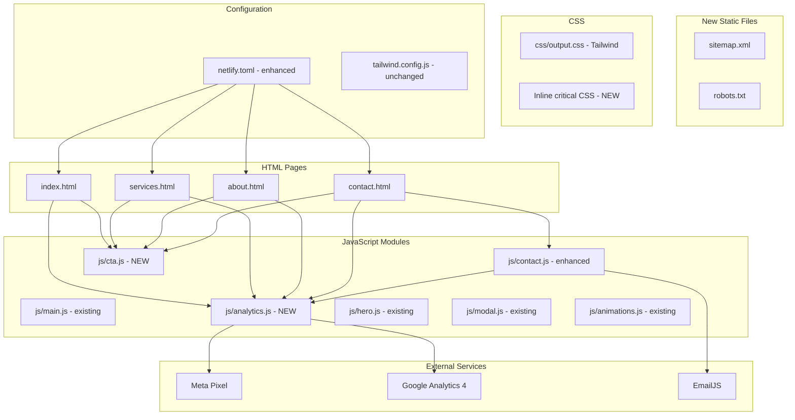
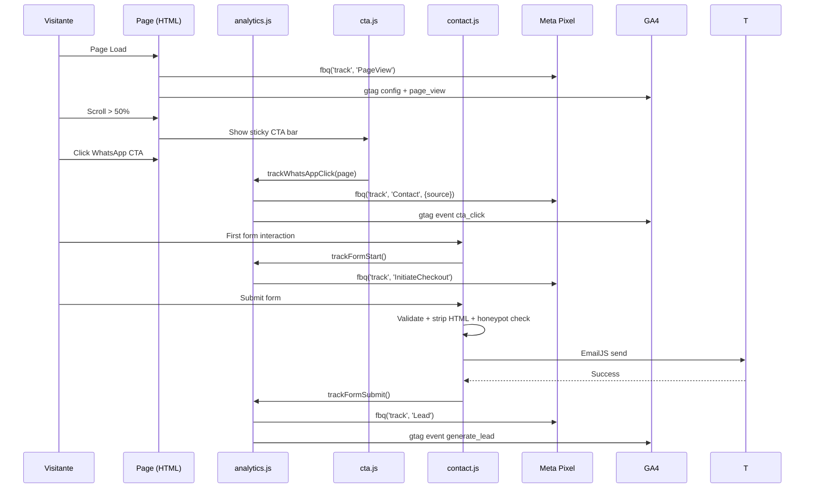

# Design Document: Product Audit Improvements

## Overview

Este documento descreve o design técnico para implementação das melhorias prioritárias identificadas na auditoria do produto digital do Grupo ImperAR. As melhorias cobrem 10 áreas: SEO técnico, performance, social proof, conversão, formulário, acessibilidade, responsividade, conteúdo, analytics e segurança.

A estratégia geral é incremental — cada área é implementada como um módulo independente que se integra ao stack existente (HTML5 + Tailwind CSS + JS vanilla), sem introduzir frameworks, build tools novos ou dependências de runtime. Todas as alterações são compatíveis com o deploy atual via Netlify.

### Decisões Arquiteturais Chave

| Decisão | Rationale |
|---------|-----------|
| JSON-LD inline em cada HTML | Sem build step para geração de schema; edição manual simples |
| Novo módulo `js/analytics.js` | Centraliza lógica de tracking (Meta Pixel + GA4) evitando duplicação |
| Novo módulo `js/cta.js` | Sticky CTA bar + event delegation para WhatsApp tracking |
| `sitemap.xml` e `robots.txt` estáticos | Site de 4 páginas; geração dinâmica seria over-engineering |
| Critical CSS inline via `<style>` tag | Extrai manualmente as regras do header + hero para first paint |
| WebP com `<picture>` fallback | Suportado por todos os browsers target; conversão via script existente |
| Security headers em `netlify.toml` | Único ponto de configuração para headers HTTP |
| Honeypot field no formulário | Anti-spam sem dependência de serviços terceiros (reCAPTCHA) |
| GA4 via gtag.js async | Padrão oficial do Google, sem impacto em LCP |

## Architecture



### Component Interaction Flow



## Components and Interfaces

### 1. analytics.js (NEW)

Módulo centralizado de tracking que abstrai Meta Pixel e GA4.

```javascript
// Interface pública
window.ImperarAnalytics = {
  trackPageView(),                    // Called on DOMContentLoaded
  trackWhatsAppClick(sourcePage),     // CTA → WhatsApp
  trackCTAClick(label, sourcePage),   // Any CTA button click
  trackFormStart(),                   // First form interaction (once per session)
  trackFormSubmit(),                  // Successful form submission
  trackCustomEvent(name, params)      // Generic fallback
};
```

**Responsabilidades:**
- Inicializar GA4 (gtag.js)
- Delegar eventos para Meta Pixel (`fbq`) com graceful fallback se `fbq` undefined
- Delegar eventos para GA4 (`gtag`) com graceful fallback se `gtag` undefined
- Guardar flag `formStartFired` para garantir single-fire do InitiateCheckout
- Parse UTM params da URL e armazenar em campos hidden do formulário

### 2. cta.js (NEW)

Gerencia a sticky CTA bar e intercepta cliques em WhatsApp links.

```javascript
// Comportamento interno (sem API pública necessária)
// - Cria sticky bar via DOM no DOMContentLoaded
// - IntersectionObserver ou scroll listener para threshold 50%/40%
// - Event delegation para capturar cliques em [href*="wa.me"]
// - Chama ImperarAnalytics.trackWhatsAppClick() antes de navigation
```

**Sticky CTA Bar Markup (gerado dinamicamente):**
```html
<div class="sticky-cta-bar" aria-hidden="true" role="complementary">
  <a href="https://wa.me/5511980979915?text=..." class="btn ...">
    Solicitar Orçamento
  </a>
</div>
```

**Posicionamento:** `fixed bottom-0 left-0 right-0` com `z-index: 35` (abaixo do floating WhatsApp em z-40), e `padding-bottom` calculado para manter 72px gap do botão floating.

### 3. contact.js (ENHANCED)

Alterações no formulário existente:

| Adição | Descrição |
|--------|-----------|
| Campo `service-type` | `<select>` com 5 opções predefinidas |
| Campo honeypot | `<input>` hidden via CSS (`position:absolute; left:-9999px`) |
| HTML stripping | `stripHtml(value)` antes de enviar ao EmailJS |
| UTM fields | Hidden inputs `utm_source`, `utm_medium`, `utm_campaign` |
| Analytics hooks | Chama `ImperarAnalytics.trackFormStart()` e `trackFormSubmit()` |
| Error fallback | Exibe link WhatsApp no erro de envio |

```javascript
// Novas funções internas
function stripHtml(str) {
  return str.replace(/<[^>]*>/g, '').trim();
}

function checkHoneypot(form) {
  const hp = form.querySelector('[data-honeypot]');
  return hp && hp.value.length > 0; // true = bot
}

function populateUTMFields() {
  const params = new URLSearchParams(window.location.search);
  ['utm_source', 'utm_medium', 'utm_campaign'].forEach(key => {
    const field = document.querySelector(`[name="${key}"]`);
    if (field) field.value = params.get(key) || '';
  });
}
```

### 4. Schema Markup (JSON-LD)

Cada página recebe um bloco `<script type="application/ld+json">` no `<head>`.

**LocalBusiness (todas as páginas):**
```json
{
  "@context": "https://schema.org",
  "@type": "LocalBusiness",
  "name": "Grupo ImperAR",
  "address": {
    "@type": "PostalAddress",
    "streetAddress": "Av. do Rio Bonito, 2206",
    "addressLocality": "São Paulo",
    "addressRegion": "SP",
    "postalCode": "04776-003",
    "addressCountry": "BR"
  },
  "telephone": "+55-11-5669-2090",
  "openingHours": "Mo-Fr 08:00-18:00",
  "areaServed": {
    "@type": "City",
    "name": "São Paulo"
  }
}
```

**Service (services.html) — 5 entradas:**
```json
{
  "@context": "https://schema.org",
  "@type": "Service",
  "provider": { "@id": "#localbusiness" },
  "name": "Apartamentos na planta",
  "description": "Planejamento e execução da climatização na fase da obra..."
}
```

### 5. Netlify Configuration (ENHANCED)

```toml
# Security headers adicionados
[[headers]]
  for = "/*"
  [headers.values]
    X-Content-Type-Options = "nosniff"
    X-Frame-Options = "SAMEORIGIN"
    Referrer-Policy = "strict-origin-when-cross-origin"
    Content-Security-Policy = "default-src 'self'; script-src 'self' 'unsafe-inline' https://connect.facebook.net https://www.googletagmanager.com https://cdn.jsdelivr.net; style-src 'self' 'unsafe-inline' https://fonts.googleapis.com; font-src https://fonts.gstatic.com; img-src 'self' data: https://www.facebook.com https://www.google-analytics.com; connect-src 'self' https://api.emailjs.com https://www.google-analytics.com https://connect.facebook.net"
```

### 6. Performance Optimizations

**Critical CSS Strategy:**
- Extrair regras do `.site-header`, `.header-inner`, reset básico e hero section
- Inline em `<style>` no `<head>` de cada página
- `output.css` carregado via `<link rel="preload" as="style" onload="this.rel='stylesheet'">`
- Fallback `<noscript><link rel="stylesheet" href="css/output.css"></noscript>`

**Image Optimization:**
- Estender `scripts/optimize-images.js` para gerar WebP
- Usar `<picture>` com `<source type="image/webp">` + `` fallback JPEG
- Hero images: max 1920px width
- Card images: max 800px width
- `width` e `height` attributes em todas as `` para prevenir CLS

**Preload:**
```html
<link rel="preload" as="image" href="hero-section/a-contemporary-high-end-apartment-located-on-a-hig.webp" type="image/webp">
```

### 7. Social Proof Components

**Testimonials Section (index.html):**
```html
<section id="depoimentos" class="py-16 lg:py-24">
  <div class="container mx-auto px-4">
    <h2>O que nossos clientes dizem</h2>
    <div class="grid grid-cols-1 md:grid-cols-3 gap-8">
      <!-- Testimonial Card -->
      <article class="bg-white rounded-2xl border border-deep/8 p-6">
        <div class="flex gap-1 mb-3" aria-label="Avaliação: 5 de 5 estrelas">
          <!-- 5 star SVGs -->
        </div>
        <blockquote class="text-gray-text mb-4">
          "Texto do depoimento..."
        </blockquote>
        <footer>
          <cite class="font-semibold text-deep">João S.</cite>
          <span class="text-sm text-gray-text">Apartamento na planta</span>
        </footer>
      </article>
    </div>
  </div>
</section>
```

**Stats Section (index.html):**
```html
<section class="py-16 lg:py-24 bg-deep">
  <div class="container mx-auto px-4">
    <div class="grid grid-cols-2 lg:grid-cols-4 gap-8 text-center text-white">
      <div><span class="text-4xl font-bold">8+</span><p>Anos de experiência</p></div>
      <div><span class="text-4xl font-bold">500+</span><p>Projetos realizados</p></div>
      <div><span class="text-4xl font-bold">50km</span><p>Raio de atendimento</p></div>
      <div><span class="text-4xl font-bold">15+</span><p>Profissionais</p></div>
    </div>
  </div>
</section>
```

**Partner Logos (index.html):**
```html
<section class="py-12">
  <div class="container mx-auto px-4">
    <p class="text-center text-sm text-gray-text mb-6">Parceiros e clientes</p>
    <div class="flex flex-wrap justify-center items-center gap-8 opacity-70">
      <!-- Logo images with grayscale filter -->
    </div>
  </div>
</section>
```

### 8. FAQ Section

Implementado com `<details>/<summary>` nativo (sem JS adicional, acessível por padrão):

```html
<section id="faq" class="py-16 lg:py-24">
  <div class="container mx-auto px-4 max-w-3xl">
    <h2>Perguntas frequentes</h2>
    <div class="space-y-4">
      <details class="group border border-deep/8 rounded-xl">
        <summary class="flex justify-between items-center p-6 cursor-pointer font-semibold text-deep">
          Como funciona o orçamento?
          <svg class="w-5 h-5 transition-transform group-open:rotate-180">...</svg>
        </summary>
        <div class="px-6 pb-6 text-gray-text">
          Resposta aqui...
        </div>
      </details>
    </div>
  </div>
</section>
```

## Data Models

### UTM Parameters Storage

```javascript
// Captured from URL on contact.html load
const utmData = {
  utm_source: string | '',    // e.g., "google", "instagram"
  utm_medium: string | '',    // e.g., "cpc", "social"
  utm_campaign: string | ''   // e.g., "inverno2024"
};
// Stored in hidden form fields, included in EmailJS payload
```

### Analytics Event Schema

```javascript
// Meta Pixel Events
{ event: 'PageView' }                              // Every page load
{ event: 'Contact', params: { source: 'index.html' } }  // WhatsApp click
{ event: 'Lead' }                                  // Form submit success
{ event: 'InitiateCheckout' }                      // First form interaction

// GA4 Events
{ event: 'page_view' }                             // Auto via config
{ event: 'cta_click', params: { cta_label: string, source_page: string } }
{ event: 'generate_lead', params: { method: 'form' } }
```

### Form Submission Payload (Enhanced)

```javascript
const templateParams = {
  from_name: string,         // stripped of HTML
  from_email: string,        // validated format
  phone: string,             // masked (XX) XXXXX-XXXX
  service_type: string,      // one of 5 predefined options
  message: string,           // stripped of HTML, 10-500 chars
  utm_source: string,        // from URL or ''
  utm_medium: string,        // from URL or ''
  utm_campaign: string       // from URL or ''
};
```

### JSON-LD Schema Structure

```javascript
// Per-page schema injection
const schemas = {
  'all_pages': { '@type': 'LocalBusiness', /* ... */ },
  'services.html': [
    { '@type': 'Service', name: 'Apartamentos na planta', description: '...' },
    { '@type': 'Service', name: 'Condomínios residenciais', description: '...' },
    { '@type': 'Service', name: 'Obras de alto padrão', description: '...' },
    { '@type': 'Service', name: 'Infraestrutura de climatização', description: '...' },
    { '@type': 'Service', name: 'Projetos VRF', description: '...' }
  ]
};
```

### Sticky CTA State

```javascript
const ctaState = {
  isVisible: boolean,        // current visibility
  threshold: 0.5,            // show at 50% scroll
  hideThreshold: 0.4,        // hide at 40% scroll
  transitionDuration: 300    // ms for fade-out
};
```


## Correctness Properties

*A property is a characteristic or behavior that should hold true across all valid executions of a system — essentially, a formal statement about what the system should do. Properties serve as the bridge between human-readable specifications and machine-verifiable correctness guarantees.*

### Property 1: Phone mask formatting preserves digits and produces valid format

*For any* string of 0–11 digits, applying the phone mask function SHALL produce a string that: (a) contains exactly the same digits in the same order as the input, (b) matches the pattern `(XX) XXXXX-XXXX` for 11 digits, `(XX) XXXX-XXXX` for 10 digits, or a prefix thereof for fewer digits, and (c) never exceeds 15 characters total.

**Validates: Requirements 5.3**

### Property 2: Sticky CTA visibility is determined by scroll position

*For any* page with total scrollable height > viewport height, the sticky CTA bar SHALL be visible when `scrollY / (documentHeight - viewportHeight) >= 0.5` and SHALL be hidden when `scrollY / (documentHeight - viewportHeight) < 0.4`. The region between 0.4 and 0.5 maintains previous state (hysteresis).

**Validates: Requirements 4.1, 4.2**

### Property 3: Form field validation correctly enforces constraints

*For any* string input to the contact form fields:
- Name passes iff trimmed length is in [2, 100]
- Email passes iff it matches the pattern `^[^\s@]+@[^\s@]+\.[^\s@]+$`
- Phone passes iff digit count is ≥ 10
- Message passes iff trimmed length is in [10, 500]

**Validates: Requirements 5.6, 5.7**

### Property 4: InitiateCheckout event fires exactly once per session

*For any* sequence of N ≥ 1 form input events in a single page session, the Meta Pixel InitiateCheckout event SHALL be fired exactly once (on the first event) and SHALL NOT be fired on subsequent events regardless of N.

**Validates: Requirements 5.5**

### Property 5: UTM parameter extraction round-trip

*For any* URL containing valid UTM query parameters (utm_source, utm_medium, utm_campaign), the extraction function SHALL correctly populate the corresponding hidden fields with the exact parameter values. *For any* URL without a given UTM parameter, the corresponding field SHALL contain an empty string.

**Validates: Requirements 9.6, 9.7**

### Property 6: HTML stripping removes all tags while preserving text content

*For any* string containing HTML tags (including nested, self-closing, and attribute-bearing tags), the `stripHtml` function SHALL produce a string with zero `<...>` sequences and SHALL preserve all text content that was between or outside tags, with leading/trailing whitespace trimmed.

**Validates: Requirements 10.5**

### Property 7: Honeypot non-empty value causes silent form rejection

*For any* form submission where the honeypot field contains a non-empty string (any length ≥ 1), the system SHALL NOT call EmailJS send and SHALL NOT display any error message to the user, effectively discarding the submission silently.

**Validates: Requirements 10.3**

## Error Handling

### Form Submission Errors

| Scenario | Handling |
|----------|----------|
| EmailJS network error | Display error message with WhatsApp fallback link; do NOT expose service IDs |
| EmailJS service unavailable | Same as network error |
| Honeypot field filled | Simulate success (show success message) to avoid signaling bot detection |
| Invalid field on blur | Show inline error below field; clear on valid input |
| Invalid field on submit | Scroll to first invalid field, focus it, show all errors |

### Analytics Failures

| Scenario | Handling |
|----------|----------|
| `fbq` undefined (Meta Pixel failed to load) | Skip Pixel events; never block navigation or throw |
| `gtag` undefined (GA4 failed to load) | Skip GA4 events; never block interaction |
| Network error on analytics request | Silent fail — analytics are fire-and-forget |

### Schema Markup Errors

| Scenario | Handling |
|----------|----------|
| Malformed JSON-LD | Browser ignores invalid `<script type="application/ld+json">`; page renders normally |
| Missing required Schema properties | Google Rich Results won't show; page unaffected |

### Image Loading Errors

| Scenario | Handling |
|----------|----------|
| WebP not supported | `<picture>` fallback to JPEG via `` source |
| Hero image fails to load | Existing hero.js fallback to gradient background (already implemented) |
| Card image fails to load | Show alt text; layout remains stable due to explicit dimensions |

### Sticky CTA Edge Cases

| Scenario | Handling |
|----------|----------|
| Page too short to scroll 50% | CTA bar never appears |
| Rapid scroll up/down | Debounced with requestAnimationFrame; no flickering |
| Reduced motion preference | CTA appears/disappears instantly (no transition) |

## Testing Strategy

### Unit Tests (Example-Based)

Focus on specific scenarios and integration points:

- Schema markup presence and validity (1 test per page)
- Meta tag content validation (length, keywords)
- Form select field options match specification
- GA4/Pixel event firing with mocked globals
- Error message content (no exposed keys)
- Focus trap behavior in modals
- Canonical URL generation per page

### Property-Based Tests

Library: **fast-check** (JavaScript PBT library)
Configuration: Minimum 100 iterations per property test.

Each correctness property (1-7) will be implemented as a single property-based test:

1. **Phone mask** — generate random digit strings (0-11 digits), verify formatting invariants
2. **Sticky CTA threshold** — generate random scroll positions [0, 1], verify visibility logic
3. **Form validation** — generate random strings, verify pass/fail matches constraints
4. **InitiateCheckout single-fire** — generate random event counts (1-100), verify single fire
5. **UTM parsing** — generate random URL param combinations, verify extraction
6. **HTML stripping** — generate random strings with embedded HTML tags, verify removal
7. **Honeypot rejection** — generate random non-empty strings, verify silent discard

Tag format: `Feature: product-audit-improvements, Property {N}: {description}`

### Integration Tests

- Lighthouse performance audit (LCP, CLS, INP thresholds)
- Contrast ratio validation (axe-core or similar)
- Viewport testing at 320px, 768px, 1024px, 1440px, 1920px
- SSL certificate validation on production
- Security headers presence in HTTP response
- Touch target sizing at mobile viewport

### Smoke Tests

- sitemap.xml exists and is valid XML
- robots.txt exists and permits indexing
- All script tags have defer/async
- JSON-LD Schema validates against schema.org
- Security headers present in netlify.toml
- SRI hash on EmailJS CDN script
- Preload link for hero image present
- Testimonials section has 3+ cards
- FAQ section has 4+ entries
- Partner logos section has 3+ logos
