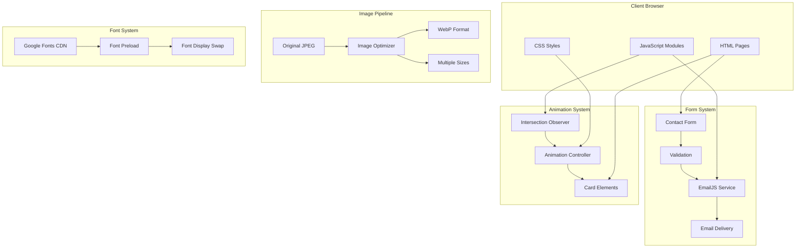
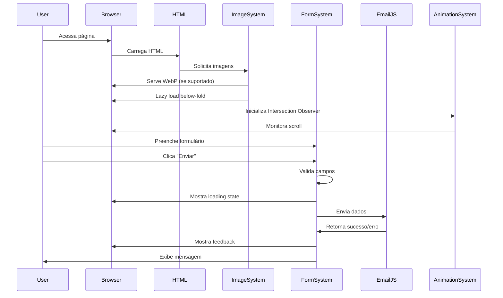
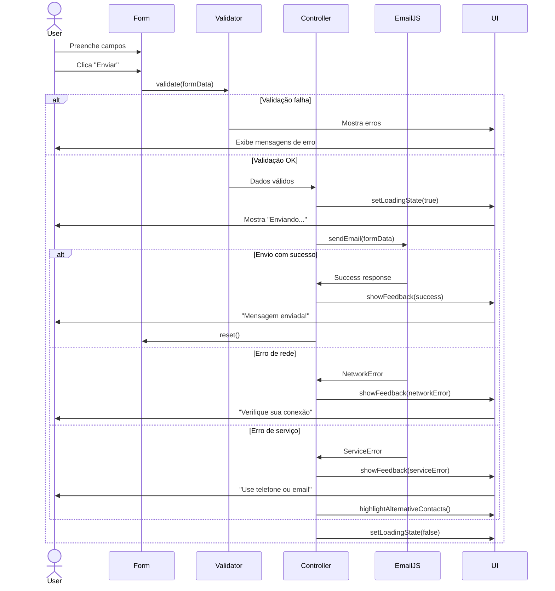
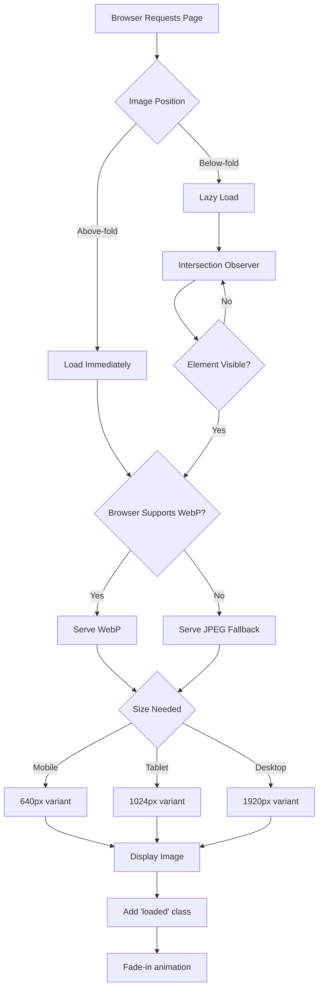
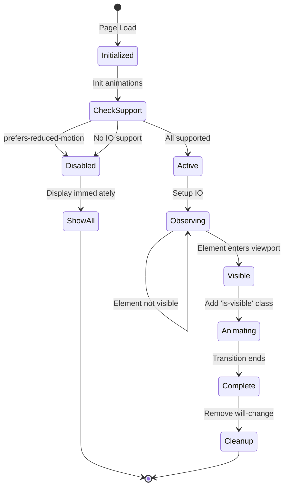
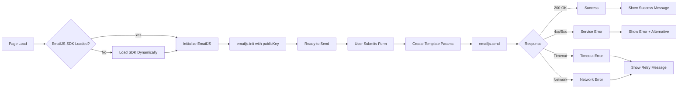
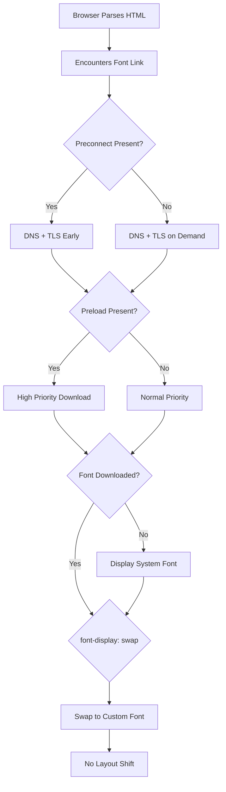
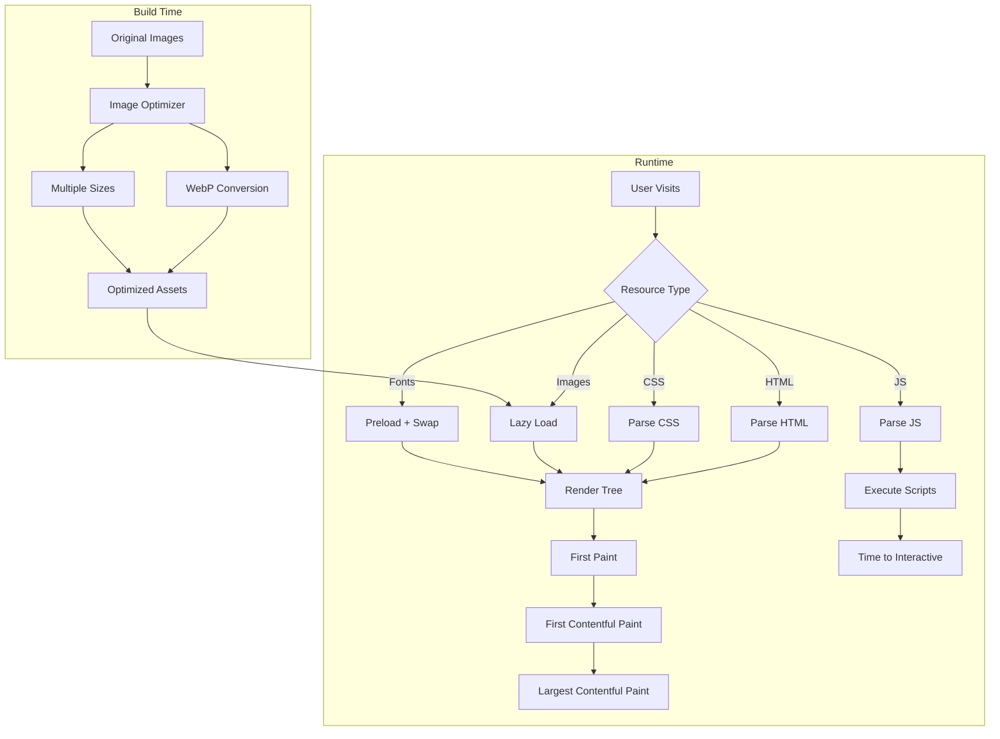

# Design Document: Pacote Quick Wins UX

## Overview

Este documento apresenta o design técnico para implementação do "Pacote Quick Wins UX" no site institucional do Grupo ImperAR. O pacote consiste em cinco melhorias principais focadas em performance e experiência do usuário:

1. **Otimização de Imagens**: Conversão para WebP, lazy loading e imagens responsivas
2. **Integração EmailJS**: Formulário de contato funcional sem backend
3. **Loading States**: Feedback visual durante envio do formulário
4. **Scroll Animations**: Animações sutis com Intersection Observer
5. **Otimização de Fontes**: Carregamento otimizado de Google Fonts

O site atual é construído com HTML, CSS e JavaScript puro, sem frameworks. Esta abordagem será mantida, adicionando funcionalidades progressivamente sem alterar a arquitetura existente.

### Objetivos de Performance

- Lighthouse Performance Score: ≥ 90 (melhoria de +15 pontos)
- First Contentful Paint: < 1.2s
- Largest Contentful Paint: < 2.5s
- Time to Interactive: < 3.5s
- Redução de payload de imagens: ≥ 40%

### Princípios de Design

- **Progressive Enhancement**: Funcionalidades básicas funcionam sem JavaScript
- **Graceful Degradation**: Suporte a navegadores sem recursos modernos
- **Performance First**: Otimizações não devem comprometer velocidade
- **Accessibility**: Respeito a preferências de movimento reduzido
- **Maintainability**: Código simples e bem documentado

## Architecture

### High-Level Architecture



### System Integration Flow



### Module Organization

```
projeto/
├── images/
│   ├── original/          # JPEG originais (backup)
│   ├── optimized/         # WebP otimizados
│   │   ├── imagem1-640.webp
│   │   ├── imagem1-1024.webp
│   │   ├── imagem1-1920.webp
│   │   └── ...
│   └── imagem1.jpeg       # Fallback JPEG
├── js/
│   ├── main.js            # Existente (navegação, header)
│   ├── contact.js         # Existente (validação)
│   ├── emailjs-integration.js  # NOVO: EmailJS
│   ├── animations.js      # NOVO: Scroll animations
│   └── image-loader.js    # NOVO: Lazy loading helper
├── css/
│   ├── styles.css         # Existente
│   └── animations.css     # NOVO: Animation styles
└── config/
    └── emailjs-config.js  # NOVO: EmailJS configuration
```

## Components and Interfaces

### 1. Image Optimization System

#### Component: ImageOptimizer (Build-time)

**Responsabilidade**: Converter e otimizar imagens durante build/deploy

**Interface**:
```javascript
// Script Node.js para otimização (executado manualmente ou em CI/CD)
interface ImageOptimizerConfig {
  inputDir: string;        // 'images/'
  outputDir: string;       // 'images/optimized/'
  formats: ['webp'];
  sizes: [640, 1024, 1920];
  quality: 85;
}

function optimizeImages(config: ImageOptimizerConfig): Promise<OptimizationResult>
```

**Ferramentas**:
- `sharp` (Node.js) ou `squoosh-cli` para conversão
- Batch script para processar todas as imagens

**Output**:
- WebP em 3 tamanhos por imagem
- Relatório de compressão (tamanho original vs otimizado)

#### Component: ResponsiveImageMarkup

**Responsabilidade**: Markup HTML para servir imagens otimizadas

**Interface**:
```html
<picture>
  <source
    type="image/webp"
    srcset="
      images/optimized/imagem1-640.webp 640w,
      images/optimized/imagem1-1024.webp 1024w,
      images/optimized/imagem1-1920.webp 1920w
    "
    sizes="(max-width: 768px) 100vw, (max-width: 1024px) 50vw, 800px"
  />
  
</picture>
```

**Decisões**:
- `<picture>` element para suporte WebP com fallback
- `loading="lazy"` para imagens below-fold
- `loading="eager"` para hero image
- `width` e `height` para evitar layout shift

### 2. EmailJS Integration System

#### Component: EmailJSService

**Responsabilidade**: Integração com EmailJS para envio de emails

**Interface**:
```javascript
// emailjs-integration.js
class EmailJSService {
  constructor(config) {
    this.serviceId = config.serviceId;
    this.templateId = config.templateId;
    this.publicKey = config.publicKey;
  }

  async initialize() {
    // Carrega SDK do EmailJS
    await this.loadSDK();
    emailjs.init(this.publicKey);
  }

  async sendEmail(formData) {
    const templateParams = {
      from_name: formData.name,
      from_email: formData.email,
      from_phone: formData.phone,
      message: formData.message,
      to_email: 'contato@grupoimperar.com.br'
    };

    try {
      const response = await emailjs.send(
        this.serviceId,
        this.templateId,
        templateParams
      );
      return { success: true, response };
    } catch (error) {
      return { success: false, error };
    }
  }

  loadSDK() {
    return new Promise((resolve, reject) => {
      if (window.emailjs) {
        resolve();
        return;
      }
      const script = document.createElement('script');
      script.src = 'https://cdn.jsdelivr.net/npm/@emailjs/browser@3/dist/email.min.js';
      script.onload = resolve;
      script.onerror = reject;
      document.head.appendChild(script);
    });
  }
}

export default EmailJSService;
```

**Configuração**:
```javascript
// config/emailjs-config.js
export const EMAIL_CONFIG = {
  serviceId: 'service_xxxxxxx',    // Obtido do EmailJS dashboard
  templateId: 'template_xxxxxxx',  // Obtido do EmailJS dashboard
  publicKey: 'xxxxxxxxxxxxxxxx'    // Public key do EmailJS
};
```

**EmailJS Template Structure**:
```
Assunto: Nova mensagem de contato - {{from_name}}

Corpo:
Nome: {{from_name}}
Email: {{from_email}}
Telefone: {{from_phone}}

Mensagem:
{{message}}

---
Enviado via formulário de contato do site Grupo ImperAR
```

#### Component: FormController

**Responsabilidade**: Orquestrar validação, loading states e envio

**Interface**:
```javascript
// Extensão de contact.js existente
class FormController {
  constructor(formElement, emailService) {
    this.form = formElement;
    this.emailService = emailService;
    this.submitButton = formElement.querySelector('button[type="submit"]');
    this.statusElement = formElement.querySelector('[data-form-status]');
    this.isSubmitting = false;
  }

  async handleSubmit(event) {
    event.preventDefault();
    
    if (this.isSubmitting) return;
    
    // 1. Validação (usa função existente)
    clearErrors(this.form);
    if (!validate(this.form)) return;
    
    // 2. Loading state
    this.setLoadingState(true);
    
    // 3. Envio
    const formData = this.getFormData();
    const result = await this.emailService.sendEmail(formData);
    
    // 4. Feedback
    this.setLoadingState(false);
    this.showFeedback(result);
    
    if (result.success) {
      this.form.reset();
    }
  }

  setLoadingState(loading) {
    this.isSubmitting = loading;
    this.submitButton.disabled = loading;
    
    if (loading) {
      this.submitButton.innerHTML = `
        <span class="spinner"></span>
        <span>Enviando...</span>
      `;
    } else {
      this.submitButton.textContent = 'Enviar';
    }
  }

  showFeedback(result) {
    if (!this.statusElement) return;
    
    const messages = {
      success: 'Mensagem enviada com sucesso! Entraremos em contato em breve.',
      networkError: 'Erro ao enviar mensagem. Verifique sua conexão e tente novamente.',
      serviceError: 'Erro no serviço de email. Por favor, entre em contato pelo telefone ou email direto.'
    };
    
    let message, type;
    if (result.success) {
      message = messages.success;
      type = 'success';
    } else if (result.error.name === 'NetworkError' || !navigator.onLine) {
      message = messages.networkError;
      type = 'error';
    } else {
      message = messages.serviceError;
      type = 'error';
      console.error('EmailJS Error:', result.error);
    }
    
    this.statusElement.textContent = message;
    this.statusElement.className = `form-status is-visible ${type}`;
    this.statusElement.setAttribute('role', 'status');
    
    // Auto-hide após 5 segundos
    setTimeout(() => {
      this.statusElement.classList.remove('is-visible');
    }, 5000);
  }

  getFormData() {
    return {
      name: this.form.querySelector('#name').value,
      email: this.form.querySelector('#email').value,
      phone: this.form.querySelector('#phone').value,
      message: this.form.querySelector('#message').value
    };
  }
}
```

### 3. Animation System

#### Component: ScrollAnimationController

**Responsabilidade**: Gerenciar animações baseadas em scroll usando Intersection Observer

**Interface**:
```javascript
// animations.js
class ScrollAnimationController {
  constructor(options = {}) {
    this.options = {
      threshold: 0.1,           // 10% visível
      rootMargin: '0px 0px -50px 0px',  // Trigger antes de entrar
      animationClass: 'is-visible',
      ...options
    };
    
    this.observer = null;
    this.elements = [];
    this.prefersReducedMotion = window.matchMedia('(prefers-reduced-motion: reduce)').matches;
  }

  init() {
    if (this.prefersReducedMotion) {
      // Mostra tudo imediatamente sem animação
      this.showAllElements();
      return;
    }

    if (!('IntersectionObserver' in window)) {
      // Fallback: mostra tudo
      this.showAllElements();
      return;
    }

    this.setupObserver();
    this.observeElements();
  }

  setupObserver() {
    this.observer = new IntersectionObserver((entries) => {
      entries.forEach(entry => {
        if (entry.isIntersecting) {
          this.animateElement(entry.target);
          this.observer.unobserve(entry.target);
        }
      });
    }, {
      threshold: this.options.threshold,
      rootMargin: this.options.rootMargin
    });
  }

  observeElements() {
    // Seleciona elementos para animar
    this.elements = document.querySelectorAll('[data-animate]');
    
    this.elements.forEach((el, index) => {
      // Adiciona delay escalonado para cards em sequência
      const delay = el.dataset.animateDelay || (index % 3) * 100;
      el.style.transitionDelay = `${delay}ms`;
      
      this.observer.observe(el);
    });
  }

  animateElement(element) {
    // Adiciona classe que trigger CSS transition
    element.classList.add(this.options.animationClass);
  }

  showAllElements() {
    document.querySelectorAll('[data-animate]').forEach(el => {
      el.classList.add(this.options.animationClass);
      el.style.opacity = '1';
      el.style.transform = 'none';
    });
  }
}

export default ScrollAnimationController;
```

#### Component: ParallaxController

**Responsabilidade**: Efeito parallax no hero section

**Interface**:
```javascript
// animations.js
class ParallaxController {
  constructor(element, options = {}) {
    this.element = element;
    this.options = {
      speed: 0.5,           // 50% da velocidade de scroll
      maxDisplacement: 100, // Máximo 100px
      ...options
    };
    
    this.ticking = false;
    this.scrollY = 0;
    this.prefersReducedMotion = window.matchMedia('(prefers-reduced-motion: reduce)').matches;
    this.isMobile = window.innerWidth < 768;
  }

  init() {
    if (this.prefersReducedMotion || this.isMobile) {
      return; // Não aplica parallax
    }

    window.addEventListener('scroll', () => {
      this.scrollY = window.scrollY;
      this.requestTick();
    }, { passive: true });
  }

  requestTick() {
    if (!this.ticking) {
      requestAnimationFrame(() => this.update());
      this.ticking = true;
    }
  }

  update() {
    const displacement = Math.min(
      this.scrollY * this.options.speed,
      this.options.maxDisplacement
    );
    
    this.element.style.transform = `translateY(${displacement}px)`;
    this.ticking = false;
  }
}

export default ParallaxController;
```

### 4. Font Optimization System

#### Component: FontLoader

**Responsabilidade**: Otimizar carregamento de fontes

**Estratégia Escolhida**: Google Fonts com `font-display: swap` e preload

**Justificativa**:
- Google Fonts CDN é globalmente distribuído (baixa latência)
- Cache compartilhado entre sites
- Menos complexidade de manutenção vs self-hosting
- `font-display: swap` garante texto visível imediatamente

**Implementação**:
```html
<!-- No <head> de todas as páginas -->

<!-- Preconnect para reduzir latência DNS/TLS -->
<link rel="preconnect" href="https://fonts.googleapis.com" />
<link rel="preconnect" href="https://fonts.gstatic.com" crossorigin />

<!-- Preload da fonte crítica (Barlow Bold para headings) -->
<link
  rel="preload"
  as="font"
  type="font/woff2"
  href="https://fonts.gstatic.com/s/barlow/v12/7cHpv4kjgoGqM7E3b8s8yn4hnCci.woff2"
  crossorigin
/>

<!-- Google Fonts com display=swap e apenas pesos usados -->
<link
  href="https://fonts.googleapis.com/css2?family=Barlow:wght@600;700;800&family=Inter:wght@400;600;700&display=swap"
  rel="stylesheet"
/>
```

**CSS Fallback Stack**:
```css
:root {
  --font-body: "Inter", system-ui, -apple-system, "Segoe UI", Roboto, Arial, sans-serif;
  --font-heading: "Barlow", var(--font-body);
}
```

**Alternativa (Self-Hosting)**: Se Google Fonts for bloqueado ou performance for inferior:

```css
/* fonts.css */
@font-face {
  font-family: 'Barlow';
  src: url('../fonts/barlow-bold.woff2') format('woff2');
  font-weight: 700;
  font-style: normal;
  font-display: swap;
}

@font-face {
  font-family: 'Inter';
  src: url('../fonts/inter-regular.woff2') format('woff2');
  font-weight: 400;
  font-style: normal;
  font-display: swap;
}
```

## Data Models

### FormData Model

```typescript
interface ContactFormData {
  name: string;          // Mínimo 1 caractere, obrigatório
  email: string;         // Formato email válido, obrigatório
  phone: string;         // Apenas números e separadores, obrigatório
  message: string;       // Mínimo 10 caracteres, obrigatório
}
```

### EmailJS Template Parameters

```typescript
interface EmailTemplateParams {
  from_name: string;     // Nome do remetente
  from_email: string;    // Email do remetente
  from_phone: string;    // Telefone do remetente
  message: string;       // Mensagem
  to_email: string;      // Email destino (contato@grupoimperar.com.br)
}
```

### Animation Configuration

```typescript
interface AnimationConfig {
  threshold: number;           // 0.0 a 1.0 (% visível para trigger)
  rootMargin: string;          // Margem do viewport
  animationClass: string;      // Classe CSS para trigger
  duration: number;            // Duração em ms
  easing: string;              // Função de timing CSS
  staggerDelay: number;        // Delay entre elementos em ms
}
```

### Image Optimization Result

```typescript
interface OptimizationResult {
  originalSize: number;        // Bytes
  optimizedSize: number;       // Bytes
  compressionRatio: number;    // Percentual de redução
  format: 'webp' | 'jpeg';
  dimensions: {
    width: number;
    height: number;
  };
  quality: number;             // 0-100
  ssim: number;                // Structural Similarity Index (0-1)
}
```

## Error Handling

### EmailJS Error Handling

```javascript
// Tipos de erro e tratamento
const ERROR_HANDLERS = {
  // Erro de rede (offline, timeout)
  NetworkError: {
    userMessage: 'Erro ao enviar mensagem. Verifique sua conexão e tente novamente.',
    logLevel: 'warn',
    retry: true
  },
  
  // Erro do serviço EmailJS (rate limit, configuração)
  ServiceError: {
    userMessage: 'Erro no serviço de email. Por favor, entre em contato pelo telefone ou email direto.',
    logLevel: 'error',
    retry: false,
    fallback: 'showAlternativeContact'
  },
  
  // Timeout (> 10 segundos)
  TimeoutError: {
    userMessage: 'A requisição demorou muito. Tente novamente.',
    logLevel: 'warn',
    retry: true
  },
  
  // Erro de validação (não deveria acontecer, validação é client-side)
  ValidationError: {
    userMessage: 'Dados inválidos. Verifique os campos e tente novamente.',
    logLevel: 'error',
    retry: false
  }
};

function handleEmailError(error) {
  const errorType = classifyError(error);
  const handler = ERROR_HANDLERS[errorType];
  
  // Log para debugging
  console[handler.logLevel]('Email sending failed:', {
    type: errorType,
    message: error.message,
    code: error.code,
    timestamp: new Date().toISOString()
  });
  
  // Mostra mensagem ao usuário
  showUserMessage(handler.userMessage, 'error');
  
  // Ações adicionais
  if (handler.fallback === 'showAlternativeContact') {
    highlightAlternativeContactMethods();
  }
  
  return {
    canRetry: handler.retry,
    errorType
  };
}

function classifyError(error) {
  if (!navigator.onLine) return 'NetworkError';
  if (error.name === 'TimeoutError') return 'TimeoutError';
  if (error.status === 400) return 'ValidationError';
  if (error.status >= 500) return 'ServiceError';
  return 'ServiceError'; // Default
}
```

### Animation Fallbacks

```javascript
// Detecção de suporte e fallbacks
const FEATURE_SUPPORT = {
  intersectionObserver: 'IntersectionObserver' in window,
  cssTransforms: CSS.supports('transform', 'translateY(0)'),
  prefersReducedMotion: window.matchMedia('(prefers-reduced-motion: reduce)').matches
};

function initAnimations() {
  if (FEATURE_SUPPORT.prefersReducedMotion) {
    // Usuário prefere movimento reduzido
    disableAllAnimations();
    return;
  }
  
  if (!FEATURE_SUPPORT.intersectionObserver) {
    // Navegador não suporta Intersection Observer
    showAllContentImmediately();
    return;
  }
  
  if (!FEATURE_SUPPORT.cssTransforms) {
    // Navegador não suporta transforms
    useFadeOnlyAnimations();
    return;
  }
  
  // Tudo suportado, inicializa normalmente
  initScrollAnimations();
  initParallax();
}
```

### Image Loading Fallbacks

```javascript
// Fallback para lazy loading
function initLazyLoading() {
  if ('loading' in HTMLImageElement.prototype) {
    // Navegador suporta loading="lazy" nativo
    // Nada a fazer, atributo HTML é suficiente
    return;
  }
  
  // Fallback: Intersection Observer
  if ('IntersectionObserver' in window) {
    implementLazyLoadingWithIO();
    return;
  }
  
  // Fallback final: carrega tudo imediatamente
  loadAllImages();
}

function implementLazyLoadingWithIO() {
  const images = document.querySelectorAll('img[loading="lazy"]');
  const imageObserver = new IntersectionObserver((entries) => {
    entries.forEach(entry => {
      if (entry.isIntersecting) {
        const img = entry.target;
        img.src = img.dataset.src || img.src;
        imageObserver.unobserve(img);
      }
    });
  });
  
  images.forEach(img => imageObserver.observe(img));
}
```

## Testing Strategy

### Unit Tests

**Objetivo**: Validar funções individuais e lógica de negócio

**Ferramentas**: Jest ou Vitest (opcional, para projeto simples pode ser manual)

**Casos de Teste**:

1. **Validação de Formulário**
   - Email válido: `test@example.com` → válido
   - Email inválido: `test@` → inválido
   - Telefone válido: `(11) 98097-9915` → válido
   - Telefone inválido: `abc123` → inválido
   - Mensagem curta: `Olá` → inválido (< 10 chars)
   - Mensagem válida: `Gostaria de um orçamento` → válido

2. **EmailJS Integration**
   - Mock de sucesso: retorna `{ success: true }`
   - Mock de erro de rede: retorna `NetworkError`
   - Mock de erro de serviço: retorna `ServiceError`
   - Timeout: requisição > 10s

3. **Animation Controller**
   - `prefersReducedMotion: true` → sem animações
   - Intersection Observer não suportado → mostra tudo
   - Elemento 10% visível → trigger animação
   - Elemento já animado → não reanima

### Integration Tests

**Objetivo**: Validar fluxos completos end-to-end

**Ferramentas**: Playwright ou Cypress (opcional)

**Cenários**:

1. **Fluxo de Envio de Formulário**
   - Preencher formulário válido
   - Clicar "Enviar"
   - Verificar loading state aparece
   - Verificar mensagem de sucesso
   - Verificar formulário foi resetado

2. **Fluxo de Erro de Formulário**
   - Preencher formulário inválido
   - Clicar "Enviar"
   - Verificar mensagens de erro aparecem
   - Corrigir erros
   - Reenviar com sucesso

3. **Scroll Animations**
   - Carregar página
   - Verificar cards inicialmente invisíveis
   - Scroll até seção de cards
   - Verificar animação de fade-in
   - Verificar stagger delay entre cards

### Performance Tests

**Objetivo**: Validar métricas de performance

**Ferramentas**: Lighthouse CI, WebPageTest

**Métricas**:

| Métrica | Baseline | Target | Método de Medição |
|---------|----------|--------|-------------------|
| Lighthouse Performance | 75 | ≥ 90 | Lighthouse CLI |
| First Contentful Paint | 1.8s | < 1.2s | Lighthouse |
| Largest Contentful Paint | 3.2s | < 2.5s | Lighthouse |
| Time to Interactive | 4.1s | < 3.5s | Lighthouse |
| Total Image Size | 2.4 MB | < 1.4 MB | Network tab |
| Number of Requests | 18 | < 20 | Network tab |

**Processo de Teste**:
1. Medir baseline antes de otimizações
2. Implementar cada fase
3. Medir após cada fase
4. Documentar melhorias incrementais
5. Validar target final

### Visual Regression Tests

**Objetivo**: Garantir que otimizações não alterem visual

**Ferramentas**: Percy, BackstopJS, ou manual

**Casos**:
- Screenshot de cada página antes/depois
- Comparação de imagens WebP vs JPEG (qualidade visual)
- Verificação de layout shift (CLS)
- Teste em diferentes viewports (mobile, tablet, desktop)

### Accessibility Tests

**Objetivo**: Validar acessibilidade das melhorias

**Ferramentas**: axe DevTools, WAVE, manual

**Casos**:
- `prefers-reduced-motion` desabilita animações
- Mensagens de formulário têm `aria-live`
- Loading states têm `aria-busy`
- Imagens têm `alt` text apropriado
- Navegação por teclado funciona
- Leitores de tela anunciam estados

### Browser Compatibility Tests

**Objetivo**: Validar suporte cross-browser

**Navegadores**:
- Chrome (últimas 2 versões)
- Firefox (últimas 2 versões)
- Safari (últimas 2 versões)
- Edge (últimas 2 versões)

**Casos**:
- WebP suportado → serve WebP
- WebP não suportado → serve JPEG
- Intersection Observer não suportado → mostra conteúdo
- `loading="lazy"` não suportado → fallback IO ou carrega tudo

### Manual Testing Checklist

```markdown
## Checklist de Testes Manuais

### Imagens
- [ ] Hero image carrega imediatamente (loading="eager")
- [ ] Imagens below-fold carregam ao scroll
- [ ] WebP é servido em Chrome/Firefox
- [ ] JPEG fallback funciona em navegadores antigos
- [ ] Imagens responsivas carregam tamanho correto
- [ ] Sem layout shift durante carregamento
- [ ] Qualidade visual aceitável

### Formulário
- [ ] Validação funciona para todos os campos
- [ ] Loading state aparece ao enviar
- [ ] Botão desabilita durante envio
- [ ] Mensagem de sucesso aparece
- [ ] Mensagem de erro aparece (simular offline)
- [ ] Formulário reseta após sucesso
- [ ] Email chega em contato@grupoimperar.com.br
- [ ] Template de email está formatado corretamente

### Animações
- [ ] Cards animam ao entrar na viewport
- [ ] Stagger delay funciona (cards aparecem em sequência)
- [ ] Parallax funciona no hero (desktop)
- [ ] Parallax desabilitado no mobile
- [ ] Animações desabilitadas com prefers-reduced-motion
- [ ] Performance mantém 60fps durante scroll
- [ ] Sem jank ou travamentos

### Fontes
- [ ] Texto aparece imediatamente (system font)
- [ ] Fontes customizadas carregam sem FOIT
- [ ] Preload funciona (Barlow carrega rápido)
- [ ] Sem layout shift ao trocar fontes

### Performance
- [ ] Lighthouse score ≥ 90
- [ ] FCP < 1.2s
- [ ] LCP < 2.5s
- [ ] TTI < 3.5s
- [ ] Payload de imagens reduzido ≥ 40%

### Compatibilidade
- [ ] Funciona em Chrome
- [ ] Funciona em Firefox
- [ ] Funciona em Safari
- [ ] Funciona em Edge
- [ ] Funciona em mobile (iOS/Android)
- [ ] Graceful degradation em navegadores antigos

### Acessibilidade
- [ ] Navegação por teclado funciona
- [ ] Leitor de tela anuncia estados do formulário
- [ ] Mensagens têm aria-live
- [ ] prefers-reduced-motion respeitado
- [ ] Contraste de cores adequado
- [ ] Focus indicators visíveis
```


## Implementation Details

### Phase 1: Image Optimization

#### Step 1.1: Setup Image Optimization Tool

**Ferramenta Escolhida**: `sharp` (Node.js)

**Justificativa**:
- Alta performance (usa libvips)
- Suporte completo a WebP
- Controle fino de qualidade
- Fácil automação

**Script de Otimização**:

```javascript
// scripts/optimize-images.js
const sharp = require('sharp');
const fs = require('fs').promises;
const path = require('path');

const CONFIG = {
  inputDir: './images',
  outputDir: './images/optimized',
  sizes: [640, 1024, 1920],
  quality: 85,
  formats: ['webp']
};

async function optimizeImage(inputPath, filename) {
  const name = path.parse(filename).name;
  const results = [];

  for (const size of CONFIG.sizes) {
    const outputPath = path.join(
      CONFIG.outputDir,
      `${name}-${size}.webp`
    );

    const info = await sharp(inputPath)
      .resize(size, null, {
        withoutEnlargement: true,
        fit: 'inside'
      })
      .webp({ quality: CONFIG.quality })
      .toFile(outputPath);

    results.push({
      size,
      outputPath,
      fileSize: info.size,
      width: info.width,
      height: info.height
    });

    console.log(`✓ ${name}-${size}.webp (${(info.size / 1024).toFixed(1)} KB)`);
  }

  return results;
}

async function main() {
  // Cria diretório de output
  await fs.mkdir(CONFIG.outputDir, { recursive: true });

  // Lista imagens JPEG
  const files = await fs.readdir(CONFIG.inputDir);
  const images = files.filter(f => /\.(jpe?g)$/i.test(f));

  console.log(`Otimizando ${images.length} imagens...\n`);

  let totalOriginal = 0;
  let totalOptimized = 0;

  for (const filename of images) {
    const inputPath = path.join(CONFIG.inputDir, filename);
    const stats = await fs.stat(inputPath);
    totalOriginal += stats.size;

    console.log(`\n${filename} (${(stats.size / 1024).toFixed(1)} KB)`);
    const results = await optimizeImage(inputPath, filename);

    results.forEach(r => {
      totalOptimized += r.fileSize;
    });
  }

  const savings = ((1 - totalOptimized / totalOriginal) * 100).toFixed(1);
  console.log(`\n✓ Concluído!`);
  console.log(`Original: ${(totalOriginal / 1024 / 1024).toFixed(2)} MB`);
  console.log(`Otimizado: ${(totalOptimized / 1024 / 1024).toFixed(2)} MB`);
  console.log(`Economia: ${savings}%`);
}

main().catch(console.error);
```

**Uso**:
```bash
npm install sharp
node scripts/optimize-images.js
```

#### Step 1.2: Update HTML Markup

**Template para Imagens Responsivas**:

```html
<!-- Hero image (above-fold, eager loading) -->
<picture>
  <source
    type="image/webp"
    srcset="
      images/optimized/imagem1-640.webp 640w,
      images/optimized/imagem1-1024.webp 1024w,
      images/optimized/imagem1-1920.webp 1920w
    "
    sizes="(max-width: 768px) 100vw, 50vw"
  />
  
</picture>

<!-- Content images (below-fold, lazy loading) -->
<picture>
  <source
    type="image/webp"
    srcset="
      images/optimized/imagem2-640.webp 640w,
      images/optimized/imagem2-1024.webp 1024w,
      images/optimized/imagem2-1920.webp 1920w
    "
    sizes="(max-width: 768px) 100vw, (max-width: 1024px) 50vw, 33vw"
  />
  
</picture>
```

**Sizes Attribute Logic**:
- Mobile (< 768px): imagem ocupa 100% da largura → `100vw`
- Tablet (768-1024px): imagem ocupa 50% da largura → `50vw`
- Desktop (> 1024px): imagem ocupa 33% da largura → `33vw`

#### Step 1.3: CSS for Image Loading States

```css
/* animations.css */

/* Placeholder enquanto imagem carrega */
img {
  background: linear-gradient(
    90deg,
    var(--c-neutral) 0%,
    rgba(244, 246, 248, 0.5) 50%,
    var(--c-neutral) 100%
  );
  background-size: 200% 100%;
}

/* Animação de shimmer */
img:not([src]) {
  animation: shimmer 1.5s infinite;
}

@keyframes shimmer {
  0% {
    background-position: -200% 0;
  }
  100% {
    background-position: 200% 0;
  }
}

/* Fade in quando imagem carrega */
img {
  opacity: 0;
  transition: opacity 0.3s ease-in;
}

img.loaded,
img[loading="eager"] {
  opacity: 1;
}
```

**JavaScript para adicionar classe "loaded"**:

```javascript
// image-loader.js
document.addEventListener('DOMContentLoaded', () => {
  const images = document.querySelectorAll('img');
  
  images.forEach(img => {
    if (img.complete) {
      img.classList.add('loaded');
    } else {
      img.addEventListener('load', () => {
        img.classList.add('loaded');
      });
    }
  });
});
```

### Phase 2: EmailJS Integration

#### Step 2.1: EmailJS Account Setup

**Processo**:

1. **Criar conta**: https://www.emailjs.com/
2. **Adicionar Email Service**:
   - Escolher provedor (Gmail, Outlook, etc.)
   - Conectar conta contato@grupoimperar.com.br
   - Obter `service_id`

3. **Criar Email Template**:
   ```
   Template Name: contact_form_submission
   
   Subject: Nova mensagem de contato - {{from_name}}
   
   From: {{from_name}} <{{from_email}}>
   Reply-To: {{from_email}}
   
   Body:
   Você recebeu uma nova mensagem através do formulário de contato do site.
   
   DADOS DO CONTATO:
   Nome: {{from_name}}
   Email: {{from_email}}
   Telefone: {{from_phone}}
   
   MENSAGEM:
   {{message}}
   
   ---
   Esta mensagem foi enviada automaticamente através do formulário de contato do site Grupo ImperAR.
   Data: {{current_date}}
   ```
   - Obter `template_id`

4. **Obter Public Key**:
   - Account > API Keys
   - Copiar Public Key

#### Step 2.2: Configuration File

```javascript
// config/emailjs-config.js

/**
 * EmailJS Configuration
 * 
 * Para obter estas credenciais:
 * 1. Acesse https://dashboard.emailjs.com/
 * 2. Service ID: Email Services > seu serviço
 * 3. Template ID: Email Templates > contact_form_submission
 * 4. Public Key: Account > API Keys
 */

export const EMAIL_CONFIG = {
  serviceId: 'service_abc123',      // Substituir com ID real
  templateId: 'template_xyz789',    // Substituir com ID real
  publicKey: 'your_public_key_here' // Substituir com chave real
};

// Timeout para requisições (10 segundos)
export const EMAIL_TIMEOUT = 10000;

// Mensagens de feedback
export const MESSAGES = {
  success: 'Mensagem enviada com sucesso! Entraremos em contato em breve.',
  networkError: 'Erro ao enviar mensagem. Verifique sua conexão e tente novamente.',
  serviceError: 'Erro no serviço de email. Por favor, entre em contato pelo telefone ou email direto.',
  timeout: 'A requisição demorou muito. Por favor, tente novamente.'
};
```

#### Step 2.3: EmailJS Integration Module

```javascript
// js/emailjs-integration.js

import { EMAIL_CONFIG, EMAIL_TIMEOUT, MESSAGES } from '../config/emailjs-config.js';

class EmailJSService {
  constructor() {
    this.initialized = false;
    this.config = EMAIL_CONFIG;
  }

  /**
   * Carrega o SDK do EmailJS dinamicamente
   */
  async loadSDK() {
    if (window.emailjs) {
      return Promise.resolve();
    }

    return new Promise((resolve, reject) => {
      const script = document.createElement('script');
      script.src = 'https://cdn.jsdelivr.net/npm/@emailjs/browser@3/dist/email.min.js';
      script.async = true;
      script.onload = resolve;
      script.onerror = () => reject(new Error('Failed to load EmailJS SDK'));
      document.head.appendChild(script);
    });
  }

  /**
   * Inicializa o EmailJS
   */
  async initialize() {
    if (this.initialized) return;

    try {
      await this.loadSDK();
      emailjs.init(this.config.publicKey);
      this.initialized = true;
      console.log('EmailJS initialized successfully');
    } catch (error) {
      console.error('EmailJS initialization failed:', error);
      throw error;
    }
  }

  /**
   * Envia email através do EmailJS
   * @param {Object} formData - Dados do formulário
   * @returns {Promise<Object>} Resultado do envio
   */
  async sendEmail(formData) {
    if (!this.initialized) {
      await this.initialize();
    }

    const templateParams = {
      from_name: formData.name,
      from_email: formData.email,
      from_phone: formData.phone,
      message: formData.message,
      to_email: 'contato@grupoimperar.com.br',
      current_date: new Date().toLocaleString('pt-BR')
    };

    try {
      // Cria promise com timeout
      const sendPromise = emailjs.send(
        this.config.serviceId,
        this.config.templateId,
        templateParams
      );

      const timeoutPromise = new Promise((_, reject) => {
        setTimeout(() => reject(new Error('Timeout')), EMAIL_TIMEOUT);
      });

      const response = await Promise.race([sendPromise, timeoutPromise]);

      console.log('Email sent successfully:', response);
      return {
        success: true,
        response,
        message: MESSAGES.success
      };

    } catch (error) {
      console.error('Email sending failed:', error);

      let errorType = 'serviceError';
      let message = MESSAGES.serviceError;

      if (error.message === 'Timeout') {
        errorType = 'timeout';
        message = MESSAGES.timeout;
      } else if (!navigator.onLine || error.name === 'NetworkError') {
        errorType = 'networkError';
        message = MESSAGES.networkError;
      }

      return {
        success: false,
        error,
        errorType,
        message
      };
    }
  }
}

// Exporta instância singleton
export default new EmailJSService();
```

#### Step 2.4: Form Controller Update

```javascript
// js/contact.js (atualização)

import emailService from './emailjs-integration.js';

// ... funções existentes (setFieldError, clearErrors, validate) ...

class FormController {
  constructor(formElement) {
    this.form = formElement;
    this.submitButton = formElement.querySelector('button[type="submit"]');
    this.statusElement = formElement.querySelector('[data-form-status]');
    this.isSubmitting = false;

    this.init();
  }

  init() {
    this.form.addEventListener('submit', (e) => this.handleSubmit(e));
  }

  async handleSubmit(event) {
    event.preventDefault();

    if (this.isSubmitting) return;

    // 1. Limpa erros anteriores
    clearErrors(this.form);
    if (this.statusElement) {
      this.statusElement.classList.remove('is-visible');
    }

    // 2. Valida formulário
    if (!validate(this.form)) {
      return;
    }

    // 3. Ativa loading state
    this.setLoadingState(true);

    // 4. Envia email
    const formData = this.getFormData();
    const result = await emailService.sendEmail(formData);

    // 5. Remove loading state
    this.setLoadingState(false);

    // 6. Mostra feedback
    this.showFeedback(result);

    // 7. Reseta formulário se sucesso
    if (result.success) {
      setTimeout(() => {
        this.form.reset();
      }, 500);
    }
  }

  setLoadingState(loading) {
    this.isSubmitting = loading;
    this.submitButton.disabled = loading;
    this.submitButton.setAttribute('aria-busy', loading);

    if (loading) {
      this.submitButton.innerHTML = `
        <svg class="spinner" width="16" height="16" viewBox="0 0 16 16" fill="none" xmlns="http://www.w3.org/2000/svg">
          <circle cx="8" cy="8" r="6" stroke="currentColor" stroke-width="2" stroke-linecap="round" stroke-dasharray="10 30" />
        </svg>
        <span>Enviando...</span>
      `;
    } else {
      this.submitButton.textContent = 'Enviar';
    }
  }

  showFeedback(result) {
    if (!this.statusElement) return;

    const type = result.success ? 'success' : 'error';
    this.statusElement.textContent = result.message;
    this.statusElement.className = `form-status is-visible ${type}`;
    this.statusElement.setAttribute('role', 'status');
    this.statusElement.setAttribute('aria-live', 'polite');

    // Auto-hide após 5 segundos
    setTimeout(() => {
      this.statusElement.classList.remove('is-visible');
    }, 5000);

    // Se erro de serviço, destaca contatos alternativos
    if (!result.success && result.errorType === 'serviceError') {
      this.highlightAlternativeContacts();
    }
  }

  highlightAlternativeContacts() {
    const contactCard = document.querySelector('aside .card');
    if (contactCard) {
      contactCard.style.border = '2px solid var(--c-sky)';
      contactCard.style.boxShadow = '0 0 0 4px rgba(58, 174, 220, 0.18)';

      setTimeout(() => {
        contactCard.style.border = '';
        contactCard.style.boxShadow = '';
      }, 3000);
    }
  }

  getFormData() {
    return {
      name: this.form.querySelector('#name').value.trim(),
      email: this.form.querySelector('#email').value.trim(),
      phone: this.form.querySelector('#phone').value.trim(),
      message: this.form.querySelector('#message').value.trim()
    };
  }
}

// Inicialização
document.addEventListener('DOMContentLoaded', () => {
  const form = document.querySelector('[data-contact-form]');
  if (form) {
    new FormController(form);
  }
});
```

#### Step 2.5: Loading State CSS

```css
/* Adicionar a animations.css */

/* Spinner animation */
.spinner {
  display: inline-block;
  animation: spin 0.8s linear infinite;
}

@keyframes spin {
  from {
    transform: rotate(0deg);
  }
  to {
    transform: rotate(360deg);
  }
}

/* Button loading state */
button[aria-busy="true"] {
  cursor: wait;
  opacity: 0.7;
}

button .spinner {
  margin-right: 8px;
  vertical-align: middle;
}

/* Form status messages */
.form-status {
  margin-top: var(--space-2);
  padding: 14px 16px;
  border-radius: 14px;
  font-size: 15px;
  line-height: 1.5;
  display: none;
  animation: slideDown 0.3s ease-out;
}

.form-status.is-visible {
  display: block;
}

.form-status.success {
  background: rgba(76, 175, 80, 0.12);
  border: 1px solid rgba(76, 175, 80, 0.3);
  color: #2e7d32;
}

.form-status.error {
  background: rgba(255, 152, 0, 0.12);
  border: 1px solid rgba(255, 152, 0, 0.3);
  color: #e65100;
}

@keyframes slideDown {
  from {
    opacity: 0;
    transform: translateY(-10px);
  }
  to {
    opacity: 1;
    transform: translateY(0);
  }
}
```

### Phase 3: Scroll Animations

#### Step 3.1: Animation CSS

```css
/* animations.css */

/* Initial state para elementos animados */
[data-animate] {
  opacity: 0;
  transform: translateY(20px);
  transition: opacity 0.5s ease-out, transform 0.5s ease-out;
}

/* State quando visível */
[data-animate].is-visible {
  opacity: 1;
  transform: translateY(0);
}

/* Performance optimization */
[data-animate] {
  will-change: opacity, transform;
}

[data-animate].is-visible {
  will-change: auto;
}

/* Disable animations para prefers-reduced-motion */
@media (prefers-reduced-motion: reduce) {
  [data-animate] {
    opacity: 1 !important;
    transform: none !important;
    transition: none !important;
  }
}

/* Parallax container */
.hero-parallax {
  transition: transform 0.1s ease-out;
  will-change: transform;
}

@media (prefers-reduced-motion: reduce) {
  .hero-parallax {
    transform: none !important;
  }
}
```

#### Step 3.2: Animation Controller

```javascript
// js/animations.js

/**
 * Scroll Animation Controller
 * Gerencia animações baseadas em Intersection Observer
 */
class ScrollAnimationController {
  constructor(options = {}) {
    this.options = {
      threshold: 0.1,
      rootMargin: '0px 0px -50px 0px',
      animationClass: 'is-visible',
      staggerDelay: 100,
      ...options
    };

    this.observer = null;
    this.elements = [];
    this.prefersReducedMotion = window.matchMedia('(prefers-reduced-motion: reduce)').matches;
  }

  init() {
    // Se usuário prefere movimento reduzido, mostra tudo imediatamente
    if (this.prefersReducedMotion) {
      this.showAllElements();
      return;
    }

    // Se Intersection Observer não é suportado, mostra tudo
    if (!('IntersectionObserver' in window)) {
      console.warn('Intersection Observer not supported, showing all elements');
      this.showAllElements();
      return;
    }

    this.setupObserver();
    this.observeElements();
  }

  setupObserver() {
    this.observer = new IntersectionObserver((entries) => {
      entries.forEach(entry => {
        if (entry.isIntersecting) {
          this.animateElement(entry.target);
          // Para de observar após animar (animação acontece uma vez)
          this.observer.unobserve(entry.target);
        }
      });
    }, {
      threshold: this.options.threshold,
      rootMargin: this.options.rootMargin
    });
  }

  observeElements() {
    // Seleciona todos os elementos com data-animate
    this.elements = document.querySelectorAll('[data-animate]');

    this.elements.forEach((el, index) => {
      // Calcula delay baseado na posição do elemento
      // Elementos em sequência têm delay escalonado
      const row = Math.floor(index / 3); // Assume grid de 3 colunas
      const col = index % 3;
      const delay = (row * this.options.staggerDelay) + (col * (this.options.staggerDelay / 3));

      el.style.transitionDelay = `${delay}ms`;

      // Começa a observar
      this.observer.observe(el);
    });

    console.log(`Observing ${this.elements.length} elements for scroll animations`);
  }

  animateElement(element) {
    // Adiciona classe que trigger CSS transition
    element.classList.add(this.options.animationClass);

    // Remove will-change após animação completar
    element.addEventListener('transitionend', () => {
      element.style.willChange = 'auto';
    }, { once: true });
  }

  showAllElements() {
    document.querySelectorAll('[data-animate]').forEach(el => {
      el.classList.add(this.options.animationClass);
      el.style.opacity = '1';
      el.style.transform = 'none';
      el.style.transition = 'none';
    });
  }

  destroy() {
    if (this.observer) {
      this.observer.disconnect();
    }
  }
}

/**
 * Parallax Controller
 * Gerencia efeito parallax no hero section
 */
class ParallaxController {
  constructor(element, options = {}) {
    this.element = element;
    this.options = {
      speed: 0.5,
      maxDisplacement: 100,
      ...options
    };

    this.ticking = false;
    this.scrollY = 0;
    this.prefersReducedMotion = window.matchMedia('(prefers-reduced-motion: reduce)').matches;
    this.isMobile = window.innerWidth < 768;
  }

  init() {
    // Não aplica parallax em mobile ou se usuário prefere movimento reduzido
    if (this.isMobile || this.prefersReducedMotion) {
      console.log('Parallax disabled (mobile or reduced motion)');
      return;
    }

    // Adiciona classe para identificar elemento parallax
    this.element.classList.add('hero-parallax');

    // Escuta scroll
    window.addEventListener('scroll', () => {
      this.scrollY = window.scrollY;
      this.requestTick();
    }, { passive: true });

    // Recalcula em resize
    window.addEventListener('resize', () => {
      this.isMobile = window.innerWidth < 768;
      if (this.isMobile) {
        this.element.style.transform = '';
      }
    }, { passive: true });
  }

  requestTick() {
    if (!this.ticking) {
      requestAnimationFrame(() => this.update());
      this.ticking = true;
    }
  }

  update() {
    if (this.isMobile) {
      this.ticking = false;
      return;
    }

    // Calcula deslocamento baseado em scroll
    const displacement = Math.min(
      this.scrollY * this.options.speed,
      this.options.maxDisplacement
    );

    // Aplica transform
    this.element.style.transform = `translateY(${displacement}px)`;

    this.ticking = false;
  }
}

// Inicialização automática
document.addEventListener('DOMContentLoaded', () => {
  // Inicializa scroll animations
  const scrollAnimations = new ScrollAnimationController();
  scrollAnimations.init();

  // Inicializa parallax no hero
  const heroImage = document.querySelector('.hero-card img');
  if (heroImage) {
    const parallax = new ParallaxController(heroImage, {
      speed: 0.3,
      maxDisplacement: 80
    });
    parallax.init();
  }
});

export { ScrollAnimationController, ParallaxController };
```

#### Step 3.3: HTML Markup Updates

```html
<!-- Adicionar data-animate aos elementos que devem animar -->

<!-- Cards de serviço -->
<div class="grid cols-3">
  <article class="card" data-animate>
    <!-- conteúdo -->
  </article>
  <article class="card" data-animate>
    <!-- conteúdo -->
  </article>
  <article class="card" data-animate>
    <!-- conteúdo -->
  </article>
</div>

<!-- Seções -->
<section class="section" data-animate>
  <!-- conteúdo -->
</section>

<!-- Bullets -->
<ul class="bullets">
  <li data-animate>Item 1</li>
  <li data-animate>Item 2</li>
  <li data-animate>Item 3</li>
</ul>
```

### Phase 4: Font Optimization

#### Step 4.1: Update Font Loading

```html
<!-- Substituir no <head> de todas as páginas -->

<!-- Preconnect (reduz latência DNS/TLS) -->
<link rel="preconnect" href="https://fonts.googleapis.com" />
<link rel="preconnect" href="https://fonts.gstatic.com" crossorigin />

<!-- Preload da fonte crítica (Barlow Bold) -->
<link
  rel="preload"
  as="font"
  type="font/woff2"
  href="https://fonts.gstatic.com/s/barlow/v12/7cHpv4kjgoGqM7E3b8s8yn4hnCci.woff2"
  crossorigin
/>

<!-- Google Fonts com display=swap e apenas pesos necessários -->
<link
  href="https://fonts.googleapis.com/css2?family=Barlow:wght@600;700;800&family=Inter:wght@400;600;700&display=swap"
  rel="stylesheet"
/>
```

#### Step 4.2: CSS Font Stack

```css
/* styles.css - já existe, apenas validar */
:root {
  /* Fallback stack robusto */
  --font-body: "Inter", system-ui, -apple-system, "Segoe UI", Roboto, Arial, sans-serif;
  --font-heading: "Barlow", var(--font-body);
}

/* Opcional: font-display via @font-face se usar self-hosting */
@font-face {
  font-family: 'Barlow';
  src: url('fonts/barlow-bold.woff2') format('woff2');
  font-weight: 700;
  font-style: normal;
  font-display: swap;
}
```

### Phase 5: Integration and Testing

#### Step 5.1: Update HTML Pages

**index.html**:
```html
<!-- Adicionar no <head> -->
<link rel="stylesheet" href="css/animations.css" />

<!-- Atualizar scripts no final do <body> -->
<script src="js/main.js" defer></script>
<script src="js/animations.js" type="module" defer></script>
```

**contact.html**:
```html
<!-- Adicionar no <head> -->
<link rel="stylesheet" href="css/animations.css" />

<!-- Atualizar scripts no final do <body> -->
<script src="js/main.js" defer></script>
<script src="js/contact.js" type="module" defer></script>
```

#### Step 5.2: Build and Deploy Checklist

```markdown
## Pre-Deploy Checklist

### Imagens
- [ ] Executar script de otimização: `node scripts/optimize-images.js`
- [ ] Verificar imagens WebP geradas em `images/optimized/`
- [ ] Atualizar markup HTML com `<picture>` elements
- [ ] Testar fallback JPEG em navegador sem WebP

### EmailJS
- [ ] Criar conta EmailJS
- [ ] Configurar email service
- [ ] Criar template de email
- [ ] Obter service_id, template_id, public_key
- [ ] Atualizar `config/emailjs-config.js` com credenciais reais
- [ ] Testar envio de email em ambiente de desenvolvimento
- [ ] Verificar email chega em contato@grupoimperar.com.br

### Animações
- [ ] Adicionar `data-animate` aos elementos desejados
- [ ] Testar scroll animations em diferentes navegadores
- [ ] Testar parallax no hero
- [ ] Verificar performance (60fps)
- [ ] Testar com prefers-reduced-motion ativado

### Fontes
- [ ] Atualizar links de fontes no <head>
- [ ] Adicionar preload para Barlow Bold
- [ ] Verificar font-display: swap está ativo
- [ ] Medir First Contentful Paint

### Performance
- [ ] Executar Lighthouse antes (baseline)
- [ ] Executar Lighthouse depois (validar melhoria)
- [ ] Verificar métricas: FCP, LCP, TTI
- [ ] Validar redução de payload de imagens

### Compatibilidade
- [ ] Testar em Chrome
- [ ] Testar em Firefox
- [ ] Testar em Safari
- [ ] Testar em Edge
- [ ] Testar em mobile (iOS/Android)

### Acessibilidade
- [ ] Validar ARIA labels
- [ ] Testar navegação por teclado
- [ ] Testar com leitor de tela
- [ ] Verificar prefers-reduced-motion

### Deploy
- [ ] Commit de cada fase separadamente
- [ ] Push para repositório
- [ ] Deploy para produção
- [ ] Smoke test em produção
- [ ] Monitorar erros (console, EmailJS)
```


## Technical Decisions

### Decision 1: WebP vs AVIF vs JPEG XL

**Decision**: Use WebP format

**Rationale**:
- **Browser Support**: WebP tem 95%+ de suporte (Chrome, Firefox, Safari 14+, Edge)
- **AVIF**: Melhor compressão, mas suporte ainda limitado (~70%) e encoding mais lento
- **JPEG XL**: Excelente qualidade, mas suporte mínimo (apenas Chrome com flag)
- **Tooling**: Sharp tem excelente suporte a WebP
- **Performance**: WebP oferece 25-35% de redução vs JPEG com qualidade similar

**Trade-offs**:
- AVIF teria melhor compressão (~20% menor que WebP)
- Mas complexidade de fallback e tempo de encoding não justificam

**Fallback Strategy**: JPEG para navegadores sem suporte (< 5% dos usuários)

### Decision 2: EmailJS vs Formspree vs Custom Backend

**Decision**: Use EmailJS

**Rationale**:
- **No Backend Required**: Site é estático, não há servidor Node/PHP
- **Free Tier**: 200 emails/mês suficiente para site institucional
- **Easy Setup**: Integração em ~30 minutos
- **Reliability**: SLA de 99.9%, infraestrutura gerenciada
- **Security**: Public key approach, sem exposição de credenciais

**Alternatives Considered**:
- **Formspree**: Similar, mas EmailJS tem melhor customização de templates
- **Custom Backend**: Overkill para volume baixo, requer manutenção
- **Netlify Forms**: Requer deploy em Netlify (site pode estar em outro host)

**Trade-offs**:
- Dependência de serviço terceiro (mitigado por fallback para contato direto)
- Limite de 200 emails/mês (suficiente para ~6-7 leads/dia)

### Decision 3: Intersection Observer vs Scroll Events

**Decision**: Use Intersection Observer API

**Rationale**:
- **Performance**: IO é assíncrono e não bloqueia main thread
- **Precision**: Detecta visibilidade real, não apenas posição de scroll
- **Battery**: Mais eficiente em mobile (menos cálculos)
- **Browser Support**: 95%+ (Chrome 51+, Firefox 55+, Safari 12.1+)
- **Code Simplicity**: Menos código que scroll events + throttling

**Alternatives Considered**:
- **Scroll Events**: Requer throttling/debouncing, mais complexo
- **CSS-only**: `animation-timeline: scroll()` ainda experimental

**Fallback**: Mostra conteúdo imediatamente em navegadores sem suporte

### Decision 4: Google Fonts vs Self-Hosted Fonts

**Decision**: Use Google Fonts with optimizations

**Rationale**:
- **CDN Performance**: Google Fonts é globalmente distribuído
- **Caching**: Shared cache entre sites (se usuário já visitou site com mesma fonte)
- **Maintenance**: Google gerencia updates e otimizações
- **Simplicity**: Menos arquivos para gerenciar no repositório
- **Preconnect + Preload**: Mitigam latência inicial

**Optimizations Applied**:
- `font-display: swap` para evitar FOIT (Flash of Invisible Text)
- Preload de Barlow Bold (fonte crítica para headings)
- Apenas pesos usados (600, 700, 800 para Barlow; 400, 600, 700 para Inter)
- Preconnect para reduzir latência DNS/TLS

**When to Switch to Self-Hosting**:
- Se Google Fonts for bloqueado em região específica
- Se performance for inferior (medir FCP antes/depois)
- Se privacidade for concern (GDPR em alguns países)

**Self-Hosting Setup** (se necessário):
```bash
# Download fonts
npx google-webfonts-helper download -f "Barlow:600,700,800" -o fonts/
npx google-webfonts-helper download -f "Inter:400,600,700" -o fonts/

# Update CSS
@font-face {
  font-family: 'Barlow';
  src: url('../fonts/barlow-v12-latin-700.woff2') format('woff2');
  font-weight: 700;
  font-display: swap;
}
```

### Decision 5: CSS Animations vs JavaScript Animations

**Decision**: Use CSS animations with JavaScript triggers

**Rationale**:
- **Performance**: CSS animations são GPU-accelerated
- **Declarative**: Mais fácil de manter e entender
- **Separation of Concerns**: Estilo em CSS, lógica em JS
- **Fallback**: Funciona mesmo se JS falhar (com `@media (prefers-reduced-motion)`)

**JavaScript Role**:
- Detecta quando elemento entra na viewport (Intersection Observer)
- Adiciona classe CSS que trigger animation
- Gerencia timing e stagger delays

**Properties Animated**:
- `opacity`: GPU-accelerated, não causa reflow
- `transform`: GPU-accelerated, não causa reflow
- **Avoid**: `width`, `height`, `margin`, `padding` (causam reflow)

### Decision 6: Lazy Loading Strategy

**Decision**: Use native `loading="lazy"` with Intersection Observer fallback

**Rationale**:
- **Native Support**: Chrome 76+, Firefox 75+, Safari 15.4+ (~90% dos usuários)
- **Zero JavaScript**: Para navegadores com suporte nativo
- **Automatic**: Browser gerencia threshold e timing
- **Fallback**: IO para navegadores antigos

**Implementation**:
```html
<!-- Navegadores modernos: lazy loading nativo -->


<!-- Navegadores antigos: JS detecta e implementa via IO -->
<script>
if (!('loading' in HTMLImageElement.prototype)) {
  // Implementa lazy loading via Intersection Observer
}
</script>
```

**Above-the-Fold Exception**:
- Hero image usa `loading="eager"` para carregamento imediato
- Evita delay perceptível na imagem principal

### Decision 7: Animation Performance Strategy

**Decision**: Use `will-change` sparingly and remove after animation

**Rationale**:
- **GPU Acceleration**: `will-change: opacity, transform` força GPU layer
- **Memory Cost**: Cada elemento com `will-change` consome memória GPU
- **Best Practice**: Adicionar antes de animar, remover após completar

**Implementation**:
```css
/* Adiciona will-change antes de animar */
[data-animate] {
  will-change: opacity, transform;
}

/* Remove após animação completar */
[data-animate].is-visible {
  will-change: auto;
}
```

**Limits**:
- Máximo 6 elementos animando simultaneamente
- Stagger delay garante que não todos animam ao mesmo tempo
- Mobile: animações mais simples ou desabilitadas

### Decision 8: Error Handling Strategy

**Decision**: User-friendly messages + detailed console logs

**Rationale**:
- **User Experience**: Mensagens claras sem jargão técnico
- **Developer Experience**: Logs detalhados para debugging
- **Fallback**: Sempre oferece alternativa (telefone, email direto)

**Error Categories**:
1. **Network Errors**: "Verifique sua conexão" + retry
2. **Service Errors**: "Use telefone ou email" + destaca contatos
3. **Timeout**: "Tente novamente" + retry
4. **Validation**: "Verifique os campos" (não deveria acontecer)

**Logging**:
```javascript
console.error('Email sending failed:', {
  type: errorType,
  message: error.message,
  code: error.code,
  timestamp: new Date().toISOString(),
  formData: { name, email } // Sem mensagem (privacidade)
});
```

### Decision 9: Progressive Enhancement Approach

**Decision**: Core functionality works without JavaScript

**Rationale**:
- **Accessibility**: Usuários com JS desabilitado podem acessar conteúdo
- **SEO**: Crawlers veem conteúdo completo
- **Resilience**: Site funciona mesmo se JS falhar

**Layers**:
1. **HTML**: Estrutura semântica, conteúdo acessível
2. **CSS**: Estilo visual, layout responsivo
3. **JavaScript**: Interatividade, animações, formulário

**Graceful Degradation**:
- Sem JS: Formulário mostra mensagem "Use telefone ou email direto"
- Sem WebP: Serve JPEG
- Sem IO: Mostra conteúdo imediatamente
- Sem CSS transforms: Fade-in apenas (opacity)

### Decision 10: Image Optimization Quality Settings

**Decision**: WebP quality 85, SSIM ≥ 0.95

**Rationale**:
- **Quality 85**: Sweet spot entre tamanho e qualidade visual
- **SSIM 0.95**: Garante diferença imperceptível ao olho humano
- **Testing**: Validação visual em diferentes telas (retina, standard)

**Quality Comparison**:
| Quality | File Size | SSIM | Visual Quality |
|---------|-----------|------|----------------|
| 100 | 100% | 1.00 | Perfeito (overkill) |
| 90 | 65% | 0.98 | Excelente |
| **85** | **50%** | **0.95** | **Muito bom** ✓ |
| 80 | 40% | 0.92 | Bom (artefatos leves) |
| 70 | 30% | 0.88 | Aceitável (artefatos visíveis) |

**Rejection Criteria**:
- SSIM < 0.95: Rejeita otimização, usa qualidade maior
- Artefatos visíveis: Aumenta qualidade para 90

## Performance Optimization Strategies

### Strategy 1: Critical Rendering Path

**Objetivo**: Minimizar tempo até First Contentful Paint

**Técnicas**:
1. **Inline Critical CSS**: CSS above-the-fold inline no `<head>`
2. **Defer Non-Critical CSS**: Carregar animations.css com `media="print" onload="this.media='all'"`
3. **Preconnect**: DNS/TLS handshake antecipado para Google Fonts
4. **Preload**: Fonte crítica (Barlow Bold) carrega prioritariamente
5. **Async Scripts**: JavaScript não bloqueia parsing HTML

**Implementation**:
```html
<head>
  <!-- Critical CSS inline -->
  <style>
    /* Apenas estilos above-the-fold */
    .hero { /* ... */ }
    .site-header { /* ... */ }
  </style>

  <!-- Non-critical CSS deferred -->
  <link rel="stylesheet" href="css/animations.css" media="print" onload="this.media='all'" />

  <!-- Preconnect -->
  <link rel="preconnect" href="https://fonts.googleapis.com" />
  <link rel="preconnect" href="https://fonts.gstatic.com" crossorigin />

  <!-- Preload -->
  <link rel="preload" as="font" type="font/woff2" href="..." crossorigin />
</head>

<body>
  <!-- Content -->

  <!-- Scripts deferred -->
  <script src="js/main.js" defer></script>
  <script src="js/animations.js" type="module" defer></script>
</body>
```

### Strategy 2: Image Loading Priority

**Objetivo**: Carregar imagens na ordem de importância

**Prioridades**:
1. **Highest**: Hero image (`loading="eager"`, above-fold)
2. **High**: Imagens visíveis no primeiro viewport
3. **Low**: Imagens below-fold (`loading="lazy"`)
4. **Lowest**: Imagens em páginas não visitadas

**Implementation**:
```html
<!-- Priority 1: Hero (eager) -->


<!-- Priority 2: Above-fold (default) -->


<!-- Priority 3: Below-fold (lazy) -->

```

### Strategy 3: JavaScript Bundle Optimization

**Objetivo**: Minimizar JavaScript payload

**Técnicas**:
1. **Code Splitting**: Módulos separados (main.js, contact.js, animations.js)
2. **Conditional Loading**: EmailJS SDK só carrega em página de contato
3. **Tree Shaking**: Remover código não usado (se usar bundler)
4. **Minification**: Minificar JS em produção

**Bundle Sizes** (estimado):
- `main.js`: ~2 KB (navegação, header)
- `contact.js`: ~3 KB (validação, form controller)
- `emailjs-integration.js`: ~2 KB (wrapper)
- `animations.js`: ~4 KB (IO, parallax)
- EmailJS SDK: ~15 KB (carregado dinamicamente)

**Total**: ~26 KB (11 KB sem página de contato)

### Strategy 4: Caching Strategy

**Objetivo**: Maximizar cache hits, minimizar re-downloads

**Headers** (configurar no servidor):
```
# Imagens (1 ano)
Cache-Control: public, max-age=31536000, immutable

# CSS/JS (1 ano com hash no nome)
Cache-Control: public, max-age=31536000, immutable

# HTML (sem cache, sempre revalidar)
Cache-Control: no-cache, must-revalidate
```

**Naming Strategy**:
- Imagens: `imagem1-640.webp` (nome estável)
- CSS/JS: `styles.css?v=1.2.0` (versioning via query string)
- Ou: `styles.abc123.css` (hash no nome, requer build tool)

### Strategy 5: Resource Hints

**Objetivo**: Antecipar recursos necessários

**Tipos**:
1. **dns-prefetch**: Resolve DNS antecipadamente
2. **preconnect**: DNS + TLS handshake
3. **prefetch**: Baixa recurso para navegação futura
4. **preload**: Baixa recurso para página atual (alta prioridade)

**Implementation**:
```html
<!-- Preconnect para Google Fonts (usado imediatamente) -->
<link rel="preconnect" href="https://fonts.googleapis.com" />

<!-- DNS-prefetch para EmailJS (usado apenas em contact.html) -->
<link rel="dns-prefetch" href="https://cdn.jsdelivr.net" />

<!-- Preload para fonte crítica -->
<link rel="preload" as="font" href="..." crossorigin />

<!-- Prefetch para página de contato (se usuário provavelmente vai visitar) -->
<link rel="prefetch" href="contact.html" />
```

### Strategy 6: Animation Performance Budget

**Objetivo**: Manter 60fps durante animações

**Limits**:
- **Simultaneous Animations**: Máximo 6 elementos
- **Animation Duration**: 400-600ms (não muito longo)
- **Stagger Delay**: 100ms entre elementos
- **Properties**: Apenas `opacity` e `transform`

**Monitoring**:
```javascript
// Detecta frame drops
let lastTime = performance.now();
function checkPerformance() {
  const now = performance.now();
  const delta = now - lastTime;
  
  if (delta > 16.67 * 2) { // > 2 frames
    console.warn('Frame drop detected:', delta);
    // Reduz animações ou desabilita
  }
  
  lastTime = now;
  requestAnimationFrame(checkPerformance);
}
```

### Strategy 7: Mobile-First Optimizations

**Objetivo**: Performance excelente em dispositivos móveis

**Técnicas**:
1. **Disable Parallax**: Sem parallax em mobile (< 768px)
2. **Smaller Images**: Serve imagens menores via srcset
3. **Reduce Animations**: Menos elementos animados em mobile
4. **Touch Optimization**: `touch-action: manipulation` para botões
5. **Viewport Meta**: `width=device-width, initial-scale=1`

**Implementation**:
```javascript
// Detecta mobile
const isMobile = window.innerWidth < 768;

if (isMobile) {
  // Desabilita parallax
  // Reduz número de animações
  // Usa imagens menores
}
```

## Deployment and Rollout Plan

### Phase 1: Image Optimization (Week 1)

**Tasks**:
1. Setup image optimization script
2. Run optimization on all images
3. Update HTML markup with `<picture>` elements
4. Test WebP support and fallback
5. Measure performance improvement

**Success Criteria**:
- Image payload reduced by ≥ 40%
- LCP improved by ≥ 0.5s
- No visual quality degradation

**Rollback Plan**:
- Revert HTML to simple `` tags
- Serve original JPEG images

### Phase 2: EmailJS Integration (Week 1-2)

**Tasks**:
1. Create EmailJS account and configure service
2. Create email template
3. Implement EmailJS integration module
4. Update form controller
5. Add loading states and feedback
6. Test email delivery

**Success Criteria**:
- Emails delivered successfully
- Loading states work correctly
- Error handling covers all cases
- User feedback is clear

**Rollback Plan**:
- Revert to original contact.js
- Show message "Use telefone ou email direto"

### Phase 3: Scroll Animations (Week 2)

**Tasks**:
1. Create animations.css
2. Implement ScrollAnimationController
3. Implement ParallaxController
4. Add `data-animate` attributes to HTML
5. Test performance (60fps)
6. Test accessibility (prefers-reduced-motion)

**Success Criteria**:
- Animations smooth at 60fps
- No jank or stuttering
- Graceful degradation works
- Accessibility respected

**Rollback Plan**:
- Remove animations.js script
- Remove `data-animate` attributes
- Content visible immediately

### Phase 4: Font Optimization (Week 2)

**Tasks**:
1. Update font loading in HTML
2. Add preconnect and preload
3. Verify font-display: swap
4. Measure FCP improvement

**Success Criteria**:
- FCP improved by ≥ 0.2s
- No FOIT (Flash of Invisible Text)
- Fonts load reliably

**Rollback Plan**:
- Revert to original font loading
- Remove preload

### Phase 5: Testing and Validation (Week 3)

**Tasks**:
1. Run Lighthouse audits
2. Test cross-browser compatibility
3. Test mobile devices
4. Validate accessibility
5. Performance testing
6. User acceptance testing

**Success Criteria**:
- Lighthouse Performance ≥ 90
- All browsers work correctly
- Mobile performance excellent
- Accessibility compliant

### Phase 6: Production Deployment (Week 3)

**Tasks**:
1. Final code review
2. Minify CSS/JS
3. Deploy to production
4. Smoke testing
5. Monitor errors
6. Collect user feedback

**Success Criteria**:
- No critical errors
- Performance targets met
- User feedback positive

## Monitoring and Maintenance

### Performance Monitoring

**Tools**:
- **Lighthouse CI**: Automated performance testing
- **WebPageTest**: Real-world performance testing
- **Google Analytics**: User metrics (bounce rate, time on page)

**Metrics to Track**:
- Lighthouse Performance Score
- First Contentful Paint (FCP)
- Largest Contentful Paint (LCP)
- Time to Interactive (TTI)
- Cumulative Layout Shift (CLS)
- Total Blocking Time (TBT)

**Alerts**:
- Performance score drops below 85
- LCP > 3.0s
- CLS > 0.1

### Error Monitoring

**EmailJS Errors**:
```javascript
// Log errors para análise
window.addEventListener('error', (event) => {
  if (event.message.includes('emailjs')) {
    console.error('EmailJS Error:', {
      message: event.message,
      filename: event.filename,
      lineno: event.lineno,
      timestamp: new Date().toISOString()
    });
    
    // Opcional: enviar para serviço de monitoring (Sentry, LogRocket)
  }
});
```

**Animation Performance**:
```javascript
// Monitora frame rate
const observer = new PerformanceObserver((list) => {
  for (const entry of list.getEntries()) {
    if (entry.duration > 50) { // > 3 frames
      console.warn('Long task detected:', entry);
    }
  }
});

observer.observe({ entryTypes: ['longtask'] });
```

### Maintenance Tasks

**Monthly**:
- Review EmailJS usage (emails sent vs limit)
- Check for EmailJS service updates
- Review error logs
- Validate performance metrics

**Quarterly**:
- Update dependencies (EmailJS SDK)
- Re-run image optimization (if new images added)
- Review browser support (update fallbacks if needed)
- Performance audit

**Annually**:
- Review EmailJS pricing (if volume increased)
- Consider self-hosting fonts (if performance better)
- Evaluate new image formats (AVIF, JPEG XL)
- Update browser compatibility targets

## Documentation

### README.md

```markdown
# Grupo ImperAR - Website

Site institucional do Grupo ImperAR com otimizações de performance e UX.

## Tecnologias

- HTML5, CSS3, JavaScript (vanilla)
- EmailJS para formulário de contato
- WebP para otimização de imagens
- Intersection Observer para scroll animations

## Estrutura

\`\`\`
projeto/
├── images/
│   ├── optimized/        # Imagens WebP otimizadas
│   └── *.jpeg            # Imagens originais (fallback)
├── js/
│   ├── main.js           # Navegação e header
│   ├── contact.js        # Formulário de contato
│   ├── emailjs-integration.js  # Integração EmailJS
│   └── animations.js     # Scroll animations
├── css/
│   ├── styles.css        # Estilos principais
│   └── animations.css    # Estilos de animação
├── config/
│   └── emailjs-config.js # Configuração EmailJS
└── scripts/
    └── optimize-images.js # Script de otimização
\`\`\`

## Setup

### 1. Otimizar Imagens

\`\`\`bash
npm install sharp
node scripts/optimize-images.js
\`\`\`

### 2. Configurar EmailJS

1. Criar conta em https://www.emailjs.com/
2. Configurar email service
3. Criar template de email
4. Atualizar `config/emailjs-config.js` com credenciais

### 3. Deploy

Fazer upload de todos os arquivos para servidor web.

## Performance

- Lighthouse Score: 90+
- First Contentful Paint: < 1.2s
- Largest Contentful Paint: < 2.5s
- Redução de imagens: 40%+

## Browser Support

- Chrome (últimas 2 versões)
- Firefox (últimas 2 versões)
- Safari (últimas 2 versões)
- Edge (últimas 2 versões)

## Manutenção

- **Adicionar novas imagens**: Executar `optimize-images.js` e atualizar HTML
- **Atualizar EmailJS**: Modificar `config/emailjs-config.js`
- **Monitorar performance**: Lighthouse CI mensal

## Contato

Para dúvidas sobre o site: contato@grupoimperar.com.br
\`\`\`

### TROUBLESHOOTING.md

```markdown
# Troubleshooting Guide

## Formulário de Contato

### Problema: Email não está sendo enviado

**Sintomas**: Mensagem de erro aparece após envio

**Possíveis Causas**:
1. Credenciais EmailJS incorretas
2. Limite de emails atingido (200/mês)
3. Problema de rede
4. Template EmailJS mal configurado

**Soluções**:
1. Verificar `config/emailjs-config.js` tem credenciais corretas
2. Verificar dashboard EmailJS para uso
3. Testar conexão de internet
4. Verificar template no dashboard EmailJS

### Problema: Loading state não aparece

**Sintomas**: Botão não mostra "Enviando..."

**Solução**: Verificar se `contact.js` está carregando corretamente (console do navegador)

## Imagens

### Problema: Imagens não carregam

**Sintomas**: Imagens aparecem quebradas

**Possíveis Causas**:
1. Caminho incorreto
2. Imagens WebP não foram geradas
3. Navegador não suporta WebP e fallback falhou

**Soluções**:
1. Verificar caminhos em `<picture>` elements
2. Executar `node scripts/optimize-images.js`
3. Verificar se `` está presente como fallback

### Problema: Imagens carregam lentamente

**Sintomas**: Delay perceptível no carregamento

**Soluções**:
1. Verificar se lazy loading está ativo (`loading="lazy"`)
2. Verificar se WebP está sendo servido (DevTools > Network)
3. Verificar tamanho das imagens (devem ser < 200 KB cada)

## Animações

### Problema: Animações não funcionam

**Sintomas**: Elementos aparecem sem animação

**Possíveis Causas**:
1. `animations.js` não está carregando
2. Intersection Observer não suportado
3. `prefers-reduced-motion` está ativo

**Soluções**:
1. Verificar console para erros
2. Testar em navegador moderno (Chrome, Firefox)
3. Verificar configurações de acessibilidade do sistema

### Problema: Animações estão travando

**Sintomas**: Scroll não é suave, animações pulam frames

**Soluções**:
1. Reduzir número de elementos com `data-animate`
2. Desabilitar parallax em mobile
3. Verificar se `will-change` está sendo removido após animação

## Performance

### Problema: Lighthouse score baixo

**Sintomas**: Score < 90

**Soluções**:
1. Verificar se imagens WebP estão sendo servidas
2. Verificar se lazy loading está ativo
3. Verificar se fontes têm `font-display: swap`
4. Verificar se scripts têm `defer`
5. Executar Lighthouse em modo incógnito (sem extensões)

### Problema: First Contentful Paint alto

**Sintomas**: FCP > 1.5s

**Soluções**:
1. Verificar se preconnect está configurado
2. Verificar se fonte crítica tem preload
3. Considerar inline critical CSS
4. Verificar tamanho do hero image

## EmailJS Errors

### Error: "Invalid public key"

**Solução**: Verificar `publicKey` em `config/emailjs-config.js`

### Error: "Template not found"

**Solução**: Verificar `templateId` em `config/emailjs-config.js`

### Error: "Service not found"

**Solução**: Verificar `serviceId` em `config/emailjs-config.js`

### Error: "Rate limit exceeded"

**Solução**: Aguardar reset mensal ou upgrade plano EmailJS

## Browser Compatibility

### Safari: WebP não funciona

**Sintoma**: Imagens JPEG sendo servidas em Safari

**Solução**: Normal. Safari < 14 não suporta WebP. Fallback JPEG está funcionando corretamente.

### IE11: Site quebrado

**Sintoma**: Layout e funcionalidades não funcionam

**Solução**: IE11 não é suportado. Recomendar upgrade para Edge, Chrome ou Firefox.

## Contato

Para problemas não listados: contato@grupoimperar.com.br
\`\`\`


## Detailed Flow Diagrams

### Form Submission Flow



### Image Loading Pipeline



### Scroll Animation Lifecycle



### EmailJS Integration Flow



### Font Loading Strategy



### Performance Optimization Pipeline



## Summary and Next Steps

### Implementation Summary

Este design document especifica a implementação completa do "Pacote Quick Wins UX" para o site do Grupo ImperAR. As melhorias são organizadas em 5 fases incrementais:

1. **Image Optimization** (Week 1)
   - Conversão para WebP com 3 tamanhos responsivos
   - Lazy loading nativo com fallback
   - Redução esperada de 40%+ no payload

2. **EmailJS Integration** (Week 1-2)
   - Formulário funcional sem backend
   - Loading states e feedback claro
   - Error handling robusto

3. **Scroll Animations** (Week 2)
   - Intersection Observer para performance
   - Parallax sutil no hero
   - Acessibilidade (prefers-reduced-motion)

4. **Font Optimization** (Week 2)
   - Google Fonts com display: swap
   - Preload de fonte crítica
   - Melhoria de FCP

5. **Testing & Deployment** (Week 3)
   - Testes cross-browser
   - Performance validation
   - Production deployment

### Expected Outcomes

**Performance Improvements**:
- Lighthouse Score: 75 → 90+ (+15 pontos)
- First Contentful Paint: 1.8s → < 1.2s (-33%)
- Largest Contentful Paint: 3.2s → < 2.5s (-22%)
- Image Payload: 2.4 MB → < 1.4 MB (-42%)

**User Experience Improvements**:
- Formulário funcional com feedback claro
- Animações sutis e profissionais
- Carregamento mais rápido e suave
- Melhor experiência em mobile

**Technical Improvements**:
- Código modular e manutenível
- Graceful degradation para navegadores antigos
- Acessibilidade compliant
- Monitoramento e error handling

### Next Steps

1. **Review deste Design Document**
   - Validar decisões técnicas
   - Confirmar escopo e timeline
   - Aprovar para implementação

2. **Setup de Ambiente**
   - Instalar dependências (sharp para otimização)
   - Criar conta EmailJS
   - Configurar ferramentas de teste

3. **Implementação Fase 1**
   - Executar script de otimização de imagens
   - Atualizar markup HTML
   - Testar WebP e fallback

4. **Implementação Fases 2-5**
   - Seguir ordem sequencial
   - Testar após cada fase
   - Documentar métricas

5. **Deployment**
   - Code review final
   - Deploy para produção
   - Monitoramento pós-deploy

### Risk Mitigation

**Riscos Identificados**:

1. **EmailJS Downtime**
   - Mitigação: Fallback para contatos diretos
   - Monitoramento: Status page do EmailJS

2. **Performance Regression**
   - Mitigação: Lighthouse CI em cada fase
   - Rollback: Git commits separados por fase

3. **Browser Compatibility Issues**
   - Mitigação: Graceful degradation
   - Testing: Cross-browser antes de deploy

4. **Image Quality Degradation**
   - Mitigação: SSIM validation ≥ 0.95
   - Fallback: Aumentar qualidade WebP para 90

### Success Metrics

**Quantitative**:
- [ ] Lighthouse Performance ≥ 90
- [ ] FCP < 1.2s
- [ ] LCP < 2.5s
- [ ] Image payload reduction ≥ 40%
- [ ] Email delivery rate > 95%

**Qualitative**:
- [ ] Animações suaves (60fps)
- [ ] Feedback claro no formulário
- [ ] Qualidade visual mantida
- [ ] Experiência mobile excelente
- [ ] Acessibilidade compliant

### Maintenance Plan

**Ongoing**:
- Monitorar EmailJS usage (200 emails/mês)
- Revisar error logs semanalmente
- Validar performance mensalmente

**Periodic**:
- Atualizar dependências trimestralmente
- Re-otimizar imagens quando adicionar novas
- Revisar browser support anualmente

### Documentation Deliverables

- [x] Design Document (este arquivo)
- [ ] README.md (instruções de setup)
- [ ] TROUBLESHOOTING.md (guia de problemas)
- [ ] Code comments (inline documentation)
- [ ] Performance baseline report
- [ ] Post-implementation report

---

**Document Version**: 1.0  
**Last Updated**: 2024  
**Author**: Kiro AI  
**Status**: Ready for Review

