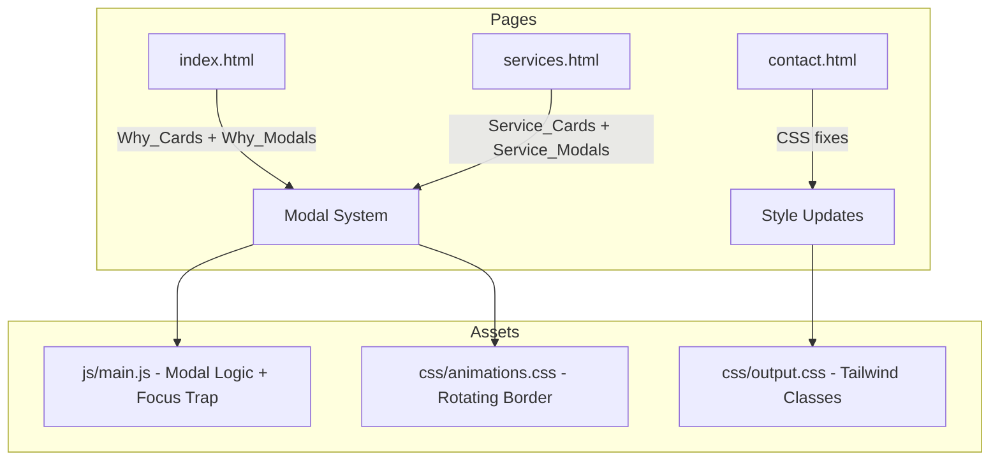

# Design Document: Visual Consistency and Service Modals

## Overview

This design addresses two categories of changes for the Grupo ImperAR website:

1. **Visual consistency fixes** (Requirements 1–8): Remove dead CSS, normalize heading sizes, standardize card padding, fix grid gaps, replace generic colors with brand colors, standardize icon containers, and add `defer` to the EmailJS script.

2. **Interactive modals** (Requirements 9–12): Add click-to-open modal dialogs for service cards on `services.html` and "Por que nos escolher" cards on `index.html`, with full keyboard accessibility (focus trap, Escape to close, focus restoration). The Why_Cards also gain a rotating gradient border animation on hover using CSS-only techniques.

All changes use vanilla HTML, CSS, and JavaScript — no frameworks. The existing Tailwind CSS (output.css) utility classes are used for styling. New CSS for animations goes into `css/animations.css`, and new JS logic goes into `js/main.js`.

## Architecture



The architecture is flat — no build pipeline changes. The modal system is a single reusable JS module within `main.js` that handles:
- Opening/closing modals
- Focus trapping
- Scroll locking
- Focus restoration
- Escape key handling
- Overlay click dismissal

### Design Decisions

1. **Single modal container per page**: Rather than duplicating modal HTML for each card, use one shared `<dialog>` element per page whose content is populated dynamically via JS when a card is clicked. This keeps the DOM lean and avoids repetition.

2. **Native `<dialog>` element**: Not used because browser support for `::backdrop` click-to-close and focus trap is inconsistent. Instead, a custom overlay `<div>` approach gives full control over focus trapping and animation timing.

3. **CSS-only rotating border**: The ElSombrero2 pattern uses `@keyframes` rotation on pseudo-elements with `conic-gradient`. No JS needed for the animation — only `animation-play-state` toggled via CSS `:hover`.

4. **Shared focus trap utility**: Both Service_Modal and Why_Modal use the same `createFocusTrap(modalElement)` function, avoiding code duplication.

## Components and Interfaces

### Modal Component (JS)

```javascript
// js/main.js additions

/**
 * Opens a modal with the given content configuration.
 * @param {Object} config
 * @param {HTMLElement} config.trigger - The element that triggered the modal
 * @param {string} config.title - Modal title text
 * @param {string} config.titleId - ID for aria-labelledby
 * @param {string} config.bodyHTML - Inner HTML for modal body
 * @param {HTMLElement} config.modalElement - The modal container element
 */
function openModal(config) { /* ... */ }

/**
 * Closes the currently open modal and restores focus.
 * @param {HTMLElement} modalElement
 * @param {HTMLElement} triggerElement
 */
function closeModal(modalElement, triggerElement) { /* ... */ }

/**
 * Creates a focus trap within the given container.
 * @param {HTMLElement} container - Element containing focusable elements
 * @returns {{ activate: Function, deactivate: Function }}
 */
function createFocusTrap(container) { /* ... */ }
```

### Modal HTML Structure

```html
<!-- Shared modal container (appended to body via JS or placed in HTML) -->
<div class="modal-overlay fixed inset-0 z-[60] bg-black/50 opacity-0 pointer-events-none transition-opacity duration-300"
     data-modal-overlay aria-hidden="true">
  <div class="modal-content fixed inset-0 z-[61] flex items-center justify-center p-4"
       role="dialog" aria-modal="true" aria-labelledby="modal-title">
    <div class="bg-white rounded-2xl max-w-lg w-full max-h-[90vh] overflow-y-auto shadow-xl">
      <button class="modal-close" data-modal-close aria-label="Fechar">×</button>
      <div data-modal-body>
        <!-- Dynamic content injected here -->
      </div>
    </div>
  </div>
</div>
```

### Rotating Gradient Border (CSS)

```css
/* css/animations.css additions */

.why-card {
  position: relative;
  border-radius: 1rem;
  overflow: hidden;
}

.why-card::before,
.why-card::after {
  content: '';
  position: absolute;
  inset: -2px;
  border-radius: inherit;
  background: conic-gradient(from 0deg, #3AAEDC, #1A2B5C, #3AAEDC);
  animation: rotate-border 3s linear infinite;
  animation-play-state: paused;
  opacity: 0;
  transition: opacity 0.3s;
}

.why-card::after {
  filter: blur(8px);
}

.why-card:hover::before,
.why-card:hover::after {
  animation-play-state: running;
  opacity: 1;
}

.why-card > .why-card-inner {
  position: relative;
  z-index: 1;
  background: #fff;
  border-radius: inherit;
  padding: 1.5rem; /* p-6 */
}

@keyframes rotate-border {
  to { transform: rotate(360deg); }
}

@media (prefers-reduced-motion: reduce) {
  .why-card::before,
  .why-card::after {
    animation: none;
  }
}
```

## Data Models

No persistent data models are needed. Modal content is stored as `data-*` attributes on the card elements:

### Service Card Data Attributes

```html
<article class="service-card" 
         data-modal-image="images/servico-apartamentos.jpeg"
         data-modal-title="Apartamentos na planta"
         data-modal-description="O Grupo ImperAR realiza projetos de climatização integrados ao planejamento de apartamentos na planta, garantindo infraestrutura adequada e conforto térmico desde a fase de obra.">
  <!-- existing card content -->
</article>
```

### Why Card Data Attributes

```html
<article class="why-card"
         data-modal-title="Equipe Especializada"
         data-modal-description="O Grupo ImperAR conta com profissionais certificados e atualizados nas principais tecnologias de climatização do mercado. A equipe atua em projetos residenciais e comerciais de diferentes portes, sempre com foco em segurança, eficiência energética e durabilidade das soluções instaladas.">
  <div class="why-card-inner">
    <!-- existing card content -->
  </div>
</article>
```

No database, no API calls, no localStorage — all data is embedded in HTML.

## Correctness Properties

*A property is a characteristic or behavior that should hold true across all valid executions of a system — essentially, a formal statement about what the system should do. Properties serve as the bridge between human-readable specifications and machine-verifiable correctness guarantees.*

### Property 1: Focus trap cycling invariant

*For any* modal containing N focusable elements (N ≥ 1), and *for any* sequence of Tab key presses of length K, the currently focused element after K presses SHALL always be one of the N focusable elements within the modal. Specifically, pressing Tab from the last focusable element wraps to the first, and pressing Shift+Tab from the first wraps to the last.

**Validates: Requirements 9.9, 10.3, 11.7**

### Property 2: Focus restoration round-trip

*For any* triggering element T that opens a modal, after the modal is closed (by any method: close button, overlay click, or Escape key), `document.activeElement` SHALL equal T.

**Validates: Requirements 10.5, 9.5, 9.6, 9.7, 11.3**

## Error Handling

This feature has minimal error surface since it's pure frontend UI with no network calls:

| Scenario | Handling |
|----------|----------|
| Card missing `data-modal-*` attributes | Modal opens with fallback text ("Informação não disponível") |
| No focusable elements in modal | Focus trap places focus on the modal container itself |
| JS disabled | Cards remain static (no click interaction); content is still visible on the cards |
| Animation not supported | Graceful degradation — no border animation, card still clickable |
| `prefers-reduced-motion: reduce` | Animation disabled, static gradient border shown instead |

## Testing Strategy

### Unit Tests (Example-based)

Given this is a vanilla HTML/CSS/JS project without a test framework, testing is primarily manual and visual:

- **CSS fixes (Req 1–8)**: Visual inspection that classes match expected values; can be verified with a simple DOM query script.
- **Modal open/close**: Click each card, verify modal appears with correct content.
- **Accessibility attributes**: Verify `role="dialog"`, `aria-modal="true"`, `aria-labelledby` present.
- **Escape key**: Press Escape while modal open, verify it closes.
- **Overlay click**: Click outside modal content, verify it closes.
- **Scroll lock**: Open modal, attempt to scroll background, verify it doesn't scroll.
- **Rotating border**: Hover Why_Card, verify gradient animation runs; leave card, verify it pauses.
- **Reduced motion**: Enable `prefers-reduced-motion: reduce`, verify static border.

### Property Tests

PBT is applicable to the focus trap logic since it's pure JavaScript with clear input/output behavior.

**Library**: [fast-check](https://github.com/dubzzz/fast-check) (if a test runner is added) or manual verification script.

**Configuration**: Minimum 100 iterations per property.

**Property 1 test approach**:
- Generate a random number of focusable elements (1–10)
- Generate a random sequence of Tab/Shift+Tab presses (1–50)
- After each press, assert `document.activeElement` is within the modal's focusable elements
- Assert wrapping behavior at boundaries

**Property 2 test approach**:
- For each triggering element (service cards × 5, why cards × 3)
- Open modal, then close via random method (close button, overlay, Escape)
- Assert `document.activeElement === triggerElement`

**Tag format**: `Feature: visual-consistency-and-service-modals, Property 1: Focus trap cycling invariant`

### Integration/Manual Tests

- Cross-browser testing (Chrome, Firefox, Safari, Edge)
- Mobile responsiveness of modals
- Screen reader testing (VoiceOver, NVDA) for modal announcements
- Keyboard-only navigation through entire modal flow
