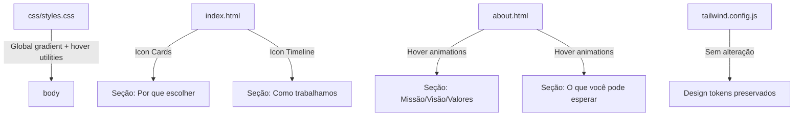

# Design Document: Visual Refinement Sections

## Overview

Este documento descreve a arquitetura e implementação das melhorias visuais em seções específicas do site Grupo ImperAR. As alterações se concentram em quatro áreas: substituição de cards com imagem por icon cards na seção "Por que escolher", substituição de números/imagens por ícones na timeline "Como trabalhamos", aplicação de um gradiente diagonal global no `body`, e refinamento visual dos cards na página Sobre.

Todas as mudanças são puramente de apresentação (HTML + CSS/Tailwind), sem necessidade de lógica JavaScript adicional. O projeto permanece como um site estático com Tailwind CSS via PostCSS.

### Decisões de Design

1. **Inline SVG sobre icon fonts**: Ícones em SVG inline para controle total de cor via `stroke` e `currentColor`, sem dependência externa.
2. **Tailwind utility-first**: Todas as novas classes usam utilitários Tailwind existentes ou classes CSS customizadas mínimas em `styles.css`.
3. **Gradiente no body via CSS custom**: Aplicado em `styles.css` ao invés de classes Tailwind no HTML, garantindo consistência global sem repetir classes em cada página.
4. **Hover via group/peer**: Uso do padrão `group-hover` do Tailwind para transições de cor no ícone quando o card é hoverado.

## Architecture



### Arquitetura de Mudanças por Arquivo

| Arquivo | Mudança |
|---------|---------|
| `css/styles.css` | Adicionar gradiente global no `body`, classe `.icon-card-hover` para transição de ícone |
| `index.html` | Refatorar cards "Por que escolher" (imagem → ícone), refatorar timeline (número+imagem → ícone) |
| `about.html` | Adicionar hover `translateY` + transição de ícone nos cards |
| `services.html` | Apenas herdar gradiente global (nenhuma mudança de conteúdo) |
| `contact.html` | Apenas herdar gradiente global (nenhuma mudança de conteúdo) |

## Components and Interfaces

### 1. Icon Card Component (index.html — "Por que escolher")

Estrutura HTML de cada card após refatoração:

```html
<article class="group contain-card bg-white rounded-2xl border border-deep/8 shadow-sm p-6 text-center
               transition-all duration-200 hover:-translate-y-1 hover:border-deep/12 hover:shadow-md"
         data-animate data-animate-delay="100">
  <!-- Icon Container -->
  <div class="w-[60px] h-[60px] rounded-full bg-ice flex items-center justify-center mx-auto mb-6
              transition-colors duration-200 group-hover:bg-primary" aria-hidden="true">
    <svg class="w-7 h-7 text-primary transition-colors duration-200 group-hover:text-white"
         xmlns="http://www.w3.org/2000/svg" viewBox="0 0 24 24" fill="none"
         stroke="currentColor" stroke-width="1.75" stroke-linecap="round" stroke-linejoin="round">
      <!-- Icon paths here -->
    </svg>
  </div>
  <h3 class="text-2xl font-semibold text-deep mb-2 font-heading">Título</h3>
  <p class="text-gray-text leading-relaxed">Descrição do benefício.</p>
</article>
```

**Ícones selecionados:**
- Equipe Especializada: Shield/Certificate (`<path d="M12 22s8-4 8-10V5l-8-3-8 3v7c0 6 8 10 8 10z"/>`)
- Atendimento Ágil: Lightning bolt (`<polyline points="13 2 3 14 12 14 11 22 21 10 12 10 13 2"/>`)
- Qualidade Garantida: Award/Star (`<circle cx="12" cy="8" r="7"/><polyline points="8.21 13.89 7 23 12 20 17 23 15.79 13.88"/>`)

### 2. Timeline Icon Component (index.html — "Como trabalhamos")

Estrutura HTML de cada step após refatoração:

```html
<div class="grid lg:grid-cols-[80px_1fr] gap-8 items-start" data-animate data-animate-delay="200">
  <div class="w-20 h-20 rounded-full border-2 border-primary flex items-center justify-center
              bg-white relative z-10 transition-all duration-200
              hover:bg-primary/10 hover:shadow-[0_0_0_4px_rgba(58,174,220,0.15)]">
    <svg class="w-8 h-8 text-primary" xmlns="http://www.w3.org/2000/svg" viewBox="0 0 24 24"
         fill="none" stroke="currentColor" stroke-width="1.75" stroke-linecap="round" stroke-linejoin="round">
      <!-- Icon paths here -->
    </svg>
  </div>
  <div>
    <h3 class="text-2xl font-semibold text-deep mb-2 font-heading">Diagnóstico</h3>
    <p class="text-gray-text leading-relaxed">Descrição da etapa.</p>
    <!-- Sem imagem  -->
  </div>
</div>
```

**Ícones selecionados:**
- Diagnóstico: Search/Magnifying glass (`<circle cx="11" cy="11" r="8"/><line x1="21" y1="21" x2="16.65" y2="16.65"/>`)
- Projeto: PenTool/Ruler (`<path d="M12 19l7-7 3 3-7 7-3-3z"/><path d="M18 13l-1.5-7.5L2 2l3.5 14.5L13 18l5-5z"/>`)
- Execução: Wrench (`<path d="M14.7 6.3a1 1 0 0 0 0 1.4l1.6 1.6a1 1 0 0 0 1.4 0l3.77-3.77a6 6 0 0 1-7.94 7.94l-6.91 6.91a2.12 2.12 0 0 1-3-3l6.91-6.91a6 6 0 0 1 7.94-7.94l-3.76 3.76z"/>`)

### 3. Global Gradient (css/styles.css)

```css
body {
  /* Existing properties preserved */
  background: linear-gradient(to bottom right, #ffffff 0%, #e8f7fd 60%, rgba(58, 174, 220, 0.03) 100%);
  min-height: 100vh;
}
```

### 4. About Page Card Hover Enhancements

Adições às classes existentes dos cards na página Sobre:

- Cards Missão/Visão/Valores: Adicionar `hover:-translate-y-1` (equivale a `translateY(-4px)`)
- Cards "O que você pode esperar": Adicionar `hover:-translate-y-1` + padrão `group`/`group-hover` para transição de cor no Icon_Container

## Data Models

Não se aplica — este feature é puramente de apresentação visual sem persistência de dados ou modelos.

## Correctness Properties

Dado que este feature é puramente visual (HTML/CSS), as propriedades de corretude são declarativas e verificáveis por inspeção:

### Property 1: Icon Card Structure Integrity

Para cada card na seção "Por que escolher", o card DEVE conter exatamente um elemento `div` circular (60×60px, bg-ice) com um SVG inline de 28×28px, e NÃO DEVE conter nenhum elemento ``.

**Validates: Requirements 1.1, 1.2, 1.9**

### Property 2: Timeline Icon Exclusivity

Para cada step na timeline "Como trabalhamos", o `Timeline_Circle` DEVE conter exatamente um SVG de 32×32px e NENHUM texto numérico visível, e o step NÃO DEVE conter um `` com classe `aspect-[16/9]`.

**Validates: Requirements 2.1, 2.5, 2.8**

### Property 3: Global Gradient Consistency

O `body` em todas as 4 páginas DEVE ter `background: linear-gradient(to bottom right, ...)` com os 3 color stops definidos, e nenhuma seção de conteúdo (exceto hero e footer) DEVE ter classes `bg-gray-light`, `bg-gradient-to-b from-white to-ice/20`, `bg-gradient-to-b from-gray-light to-ice/20`, ou `bg-gradient-to-b from-ice to-primary/5`.

**Validates: Requirements 3.1, 3.2, 3.6**

### Property 4: Hover Transition Uniformity

Todo card com hover animation DEVE usar `translateY(-4px)` com `duration-200` e `cubic-bezier(0.4, 0, 0.2, 1)`, garantindo comportamento consistente entre seções.

**Validates: Requirements 4.1, 4.2, 4.6**

### Property 5: Non-Modification Boundary

Os arquivos `services.html` (service cards), `tailwind.config.js`, header, footer e portfolio grid NÃO DEVEM ter alterações estruturais ou de conteúdo.

**Validates: Requirements 5.1, 5.2, 5.3, 5.4, 5.5**

## Error Handling

| Cenário | Tratamento |
|---------|-----------|
| SVG não renderiza (navegador antigo) | O `Icon_Container` mantém seu background circular, exibindo container vazio sem quebrar layout |
| Tailwind classes não compilam | Build PostCSS falha — verificar `safelist` em `tailwind.config.js` para classes dinâmicas |
| Gradiente não suportado (IE11) | Fallback natural: `background-color: var(--c-white)` já definido. IE11 fora do escopo |
| Hover não funciona (touch) | Cards permanecem no estado default — sem degradação visual |

## Testing Strategy

**Por que PBT não se aplica**: Este feature é inteiramente de UI rendering e CSS styling. Não há lógica de negócio, transformações de dados ou funções puras para testar. As mudanças são visuais/declarativas.

### Abordagem de Testes

1. **Testes visuais manuais**:
   - Verificar cada card renderiza ícone no container circular
   - Verificar hover transitions em todos os cards (index + about)
   - Verificar gradiente visível ao scrollar as páginas
   - Verificar que imagens foram removidas das seções refatoradas
   - Testar em viewports: mobile (375px), tablet (768px), desktop (1440px)

2. **Checklist de regressão**:
   - services.html: cards com imagem inalterados
   - Header/footer: sem mudanças visuais
   - Portfolio grid: sem mudanças
   - CTA sections: sem mudanças
   - Cores e design tokens: inalterados

3. **Build verification**:
   - `npx tailwindcss -i css/input.css -o css/output.css` compila sem erros
   - Verificar que novas classes Tailwind (e.g., `group-hover:bg-primary`, `hover:-translate-y-1`) estão incluídas no output

4. **Cross-browser**:
   - Chrome, Firefox, Safari, Edge (últimas 2 versões)
   - Verificar gradiente diagonal e transições CSS

5. **Acessibilidade**:
   - Ícones decorativos com `aria-hidden="true"`
   - Contraste de texto preservado (não há mudanças em cores de texto)
   - Hover não é a única forma de distinguir informação
